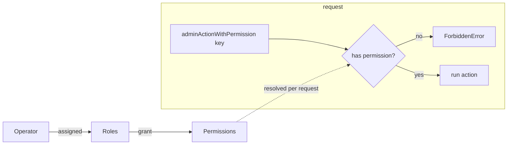

# Operator console (admin)

The admin console at `/admin` is a **separate, isolated system** from the public
app: its own BetterAuth instance, DB schema/connection, secret and cookies (see
[`docs/auth.md`](./auth.md)). Operators are provisioned out of band (no
self-signup); authorization is permission-based (PBAC).

## Authorization (PBAC)

- **Permissions** are a fixed catalogue in
  [`@workspace/auth/permissions`](../packages/auth/src/permissions.ts) — add a
  key, then `pnpm admin:sync-permissions`.
- **Roles** are dynamic; operators grant permissions to roles and roles to
  operators from the console (`/admin/roles`, `/admin/operators`).
- Server actions use `adminActionWithPermission('x.y')`; pages re-check with
  `getOperatorPermissions(...)` and `redirect('/admin')` if missing. The sidebar
  hides sections the operator can't access.

## Sections

| Route               | Permission                           | What                                                                         |
| ------------------- | ------------------------------------ | ---------------------------------------------------------------------------- |
| `/admin`            | `console.access`                     | Dashboard (operator's permissions)                                           |
| `/admin/users`      | `users.read` / `users.write`         | End-user list; deactivate, reactivate, force-logout                          |
| `/admin/operators`  | `operators.read` / `operators.write` | Operators + role assignment, activate/deactivate                             |
| `/admin/roles`      | `roles.read` / `roles.write`         | Create roles, toggle their permissions                                       |
| `/admin/monitoring` | `monitoring.read`                    | Sentry issues, event volume, links (see [observability](./observability.md)) |

Deactivating a user soft-deletes them, revokes their sessions, and blocks future
sign-in (a `session.create` hook). Deactivating an operator revokes their
sessions immediately; you can't deactivate yourself.

## Structure

- `app/admin/layout.tsx` — applies the `.admin` theme + `noindex`.
- `app/admin/(console)/layout.tsx` — auth gate + the sidebar/topbar shell.
  `/admin/login` lives outside this group (no shell).
- Reusable pieces: `components/admin/admin-sidebar`, `page-header`, `stat-card`,
  `bar-chart`. Read models live in `features/admin-*`.

## Distinct look (customizable)

The console uses a **different theme** from the public site — a teal accent and a
permanently dark sidebar — scoped to the `.admin` class in
[`globals.css`](../packages/ui/src/styles/globals.css). It's the same token model
as the site theme ([`docs/theming.md`](./theming.md)): change the hue in the
`.admin` block to re-accent the whole console. Only the tokens differ; the
components are shared.

## Adding a section

1. Add the permission to the catalogue + `pnpm admin:sync-permissions`.
2. Create `app/admin/(console)/<section>/page.tsx`, gated on the permission.
3. Put mutations in `actions.ts` behind `adminActionWithPermission`.
4. Add a nav entry (with its permission) to `admin-sidebar.tsx`.
