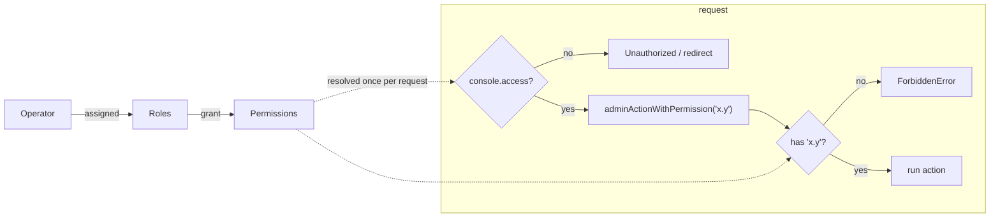

# Operator console (admin)

The admin console at `/admin` is a separate, isolated system from the public app,
gated by a baseline `console.access` permission with finer-grained, permission-
based access (PBAC) per section.

## Overview

The console has its own BetterAuth instance, DB schema/connection, secret and
cookies (see [`docs/auth.md`](./auth.md)). Operators are provisioned out of band
(no self-signup). Every operator must hold the baseline `console.access`
permission — enforced in both `adminActionClient` and the console layout (via
`requireOperator` in `apps/web/lib/admin-guard.ts`) — so per-resource permissions
are never the only thing between an account and the console.

## How it works



- **Permissions** are a fixed catalogue in
  [`@workspace/auth/permissions`](../packages/auth/src/permissions.ts) — add a
  key, then `pnpm admin:sync-permissions`.
- **Roles** are dynamic; operators grant permissions to roles and roles to
  operators from the console (`/admin/roles`, `/admin/operators`).
- Server actions use `adminActionWithPermission('x.y')` (built on
  `adminActionClient`, which already requires `console.access`); pages re-verify
  with `requireOperator('x.y')`. The sidebar hides sections the operator can't
  access.

## Authorization (PBAC)

`adminActionClient` resolves the operator's permission set once and rejects
anyone lacking `console.access`. `adminActionWithPermission` layers a specific
permission on top:

```ts
// apps/web/lib/admin-safe-action.ts
export function adminActionWithPermission(required: AdminPermissionKey) {
  return adminActionClient.use(({ next, ctx }) => {
    if (!ctx.permissions.has(required)) {
      throw new ForbiddenError()
    }
    return next({ ctx })
  })
}
```

Pages use the matching server-side gate:

```ts
// e.g. app/admin/(console)/users/page.tsx
const { permissions } = await requireOperator('users.read')
```

## Console pages

| Route               | Permission                           | What                                                                   |
| ------------------- | ------------------------------------ | ---------------------------------------------------------------------- |
| `/admin`            | `console.access`                     | Dashboard (operator's permissions)                                     |
| `/admin/users`      | `users.read` / `users.write`         | End-user list; deactivate, reactivate, force-logout                    |
| `/admin/operators`  | `operators.read` / `operators.write` | Operators + role assignment, activate/deactivate                       |
| `/admin/roles`      | `roles.read` / `roles.write`         | Create roles, toggle their permissions                                 |
| `/admin/monitoring` | `monitoring.read`                    | System-health dashboard (DB/Redis/outbox/jobs/audit) + optional Sentry |
| `/admin/jobs`       | `jobs.read` / `jobs.write`           | Queue inspection + outbox dead-letter replay/discard                   |

Deactivating a user soft-deletes them, revokes their sessions, and blocks future
sign-in (a `session.create` hook). Deactivating an operator revokes their
sessions immediately; you can't deactivate yourself.

## Monitoring (Sentry-free by default)

`/admin/monitoring` is a **system-health dashboard that works with no external
services**: DB and Redis liveness probes, the outbox backlog, pg-boss queue
depth, and recent audit activity — all from data the stack already persists
(`features/admin-monitoring/system-health-section.tsx`). The Sentry panel
(issues, event volume, links) renders **only** when `SENTRY_AUTH_TOKEN` / `ORG` /
`PROJECT` are configured; otherwise it shows a "not configured" hint. See
[observability](./observability.md).

## Key files

| Concern                   | Path                                                           |
| ------------------------- | -------------------------------------------------------------- |
| Action client + PBAC      | `apps/web/lib/admin-safe-action.ts`                            |
| Page-level gate           | `apps/web/lib/admin-guard.ts` (`requireOperator`)              |
| Resolve permissions       | `apps/web/lib/admin-permissions.ts`                            |
| Permission catalogue      | `packages/auth/src/permissions.ts`                             |
| Theme + `noindex` layout  | `apps/web/app/admin/layout.tsx`                                |
| Console shell (auth gate) | `apps/web/app/admin/(console)/layout.tsx`                      |
| Sidebar nav               | `apps/web/components/admin/admin-sidebar.tsx`                  |
| System-health panel       | `apps/web/features/admin-monitoring/system-health-section.tsx` |

`/admin/login` lives outside the `(console)` group (no shell). Reusable pieces:
`components/admin/admin-sidebar`, `page-header`, `stat-card`, `bar-chart`. Read
models live in `features/admin-*`.

## Usage / commands

```bash
pnpm admin:create-operator --email you@example.com --name "You" --super
pnpm admin:sync-permissions     # after editing the permission catalogue
```

## Distinct look (customizable)

The console uses a different theme from the public site — a teal accent and a
permanently dark sidebar — scoped to the `.admin` class in
[`globals.css`](../packages/ui/src/styles/globals.css). It's the same token model
as the site theme ([`docs/theming.md`](./theming.md)): change the hue in the
`.admin` block to re-accent the whole console. Only the tokens differ; the
components are shared.

## How to extend — adding a section

1. Add the permission to the catalogue + `pnpm admin:sync-permissions`.
2. Create `app/admin/(console)/<section>/page.tsx`, gated with
   `requireOperator('<perm>')`.
3. Put mutations in `actions.ts` behind `adminActionWithPermission('<perm>')`.
4. Add a nav entry (with its permission) to `admin-sidebar.tsx`.

## Related docs

- [Authentication](./auth.md)
- [Observability](./observability.md)
- [Jobs](./jobs.md)
- [Theming](./theming.md)
