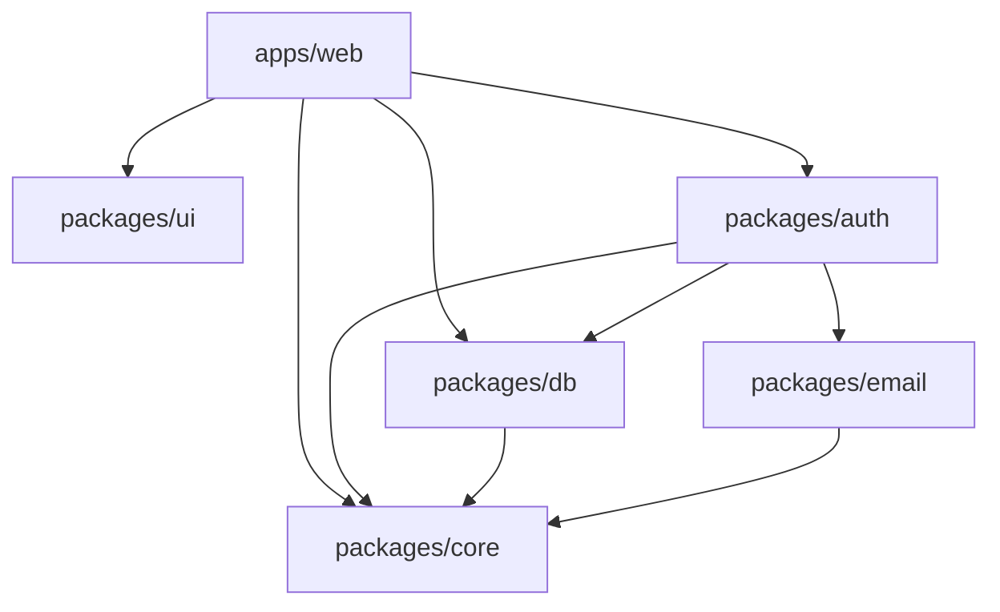
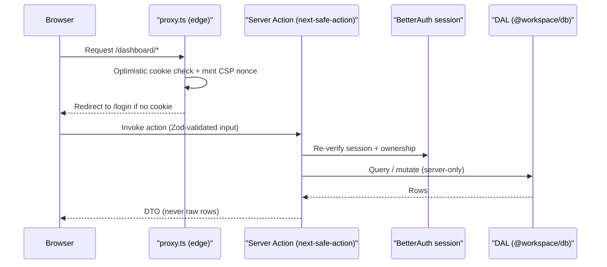

# Architecture

A server-first pnpm + Turborepo monorepo: default to Server Components and
Server Actions, keep `'use client'` at the leaves, and enforce a strict
dependency direction in CI (`pnpm boundaries`) so the structure can't silently
rot.

## Overview

Application code lives in `apps/web` (Next.js 16, App Router, no `src/`).
Everything reusable is a workspace package: `core` (framework-agnostic
primitives), `db` (Drizzle + Postgres), `auth` (two BetterAuth instances),
`ui` (presentational), and the shared lint/TS configs. The app is the only
place that composes the packages together; packages never import the app, and
`core` depends on nothing internal. This keeps the foundation portable and the
boundaries machine-checkable (see [ADR-0002](./adr/0002-machine-checked-architecture-boundaries.md)).

## How it works

The package dependency graph (enforced by dependency-cruiser):



A typical authenticated mutation flows edge → action → DAL → DTO:



1. `proxy.ts` does an optimistic cookie check for `/dashboard` and `/admin`
   (fast redirects only — never a security boundary) and mints the per-request
   CSP nonce.
2. Pages and Server Actions re-verify the session server-side through the
   relevant BetterAuth instance.
3. Mutations go through `next-safe-action` clients (`actionClient`,
   `authActionClient`, `adminActionClient`), which normalize errors and inject
   the authenticated principal into `ctx`.
4. Data access uses Drizzle against `@workspace/db` (`server-only`); actions
   return DTOs, never raw rows.

## Key files

| Concern             | Path                                                                                                    |
| ------------------- | ------------------------------------------------------------------------------------------------------- |
| App (App Router)    | [`apps/web`](../apps/web)                                                                               |
| Edge proxy / CSP    | `@/proxy` ([`apps/web/proxy.ts`](../apps/web/proxy.ts))                                                 |
| User action clients | `@/lib/safe-action` ([`apps/web/lib/safe-action.ts`](../apps/web/lib/safe-action.ts))                   |
| Admin action client | `@/lib/admin-safe-action` ([`apps/web/lib/admin-safe-action.ts`](../apps/web/lib/admin-safe-action.ts)) |
| Core primitives     | `@workspace/core` ([`packages/core`](../packages/core))                                                 |
| Data layer          | `@workspace/db` ([`packages/db`](../packages/db))                                                       |
| Auth instances      | `@workspace/auth` ([`packages/auth`](../packages/auth))                                                 |
| Boundary rules      | [`.dependency-cruiser.cjs`](../.dependency-cruiser.cjs)                                                 |

## Usage / example

A user-facing Server Action: validate input with Zod, re-verify the principal
(injected as `ctx` by `authActionClient`), and return a DTO.

```ts
import { authActionClient } from '@/lib/safe-action'
import { updateProfileSchema } from '@/features/profile/schema'

export const updateProfile = authActionClient
  .metadata({ actionName: 'updateProfile' })
  .inputSchema(updateProfileSchema)
  .action(async ({ ctx, parsedInput }) => {
    // ctx.user is the verified session principal.
    return updateProfileDal(ctx.user.id, parsedInput)
  })
```

## How to extend

1. Scaffold a feature module with `/new-feature` (runs the `new-feature`
   skill); it lays down the action / DAL / schema / UI seams.
2. Put framework-agnostic logic in `@workspace/core`, DB access behind
   `@workspace/db`, and keep `'use client'` at component leaves.
3. Run `pnpm boundaries` to confirm the dependency graph still holds, then
   `pnpm check` before committing.

## Configuration

Environment is read via `@/env` (apps/web) or each package's validated env —
never raw `process.env` in app code. See per-domain docs for the relevant
variables.

## Conventions

- **Types**: strict TS 6 — no `any`, `import type`, exhaustive switches.
  Business logic uses `Result`/`AppError` from `@workspace/core`.
- **i18n**: every user- or operator-facing string lives in
  `apps/web/messages/fr.json`. Server validation uses the localized helpers in
  `apps/web/lib/validation.ts`; client forms use `useTranslations`.
- **Client state**: Zustand (`apps/web/lib/stores`) for ephemeral UI state only;
  server data stays in TanStack Query / Server Components, URL state in nuqs.
- **Theming**: edit the `--brand-*` block in `packages/ui/src/styles/globals.css`.
- **Commits**: Conventional Commits enforced by commitlint + husky. CI/E2E run
  against `development`; `production` is the deploy branch.

## Related docs

- [Authentication & authorization](./auth.md)
- [Security](./security.md)
- [Observability](./observability.md)
- [Database](./database.md)
- [ADR-0002 — Machine-checked module boundaries](./adr/0002-machine-checked-architecture-boundaries.md)
