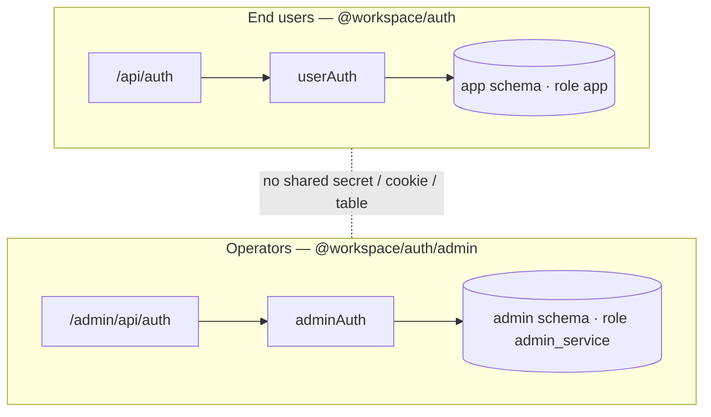
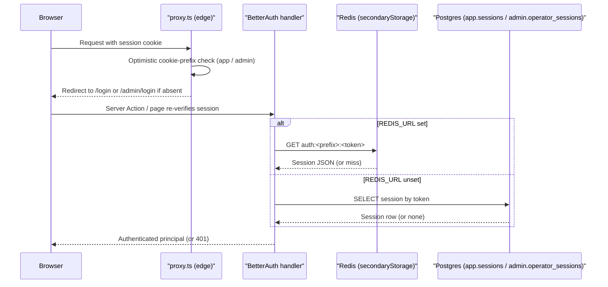

# Authentication & authorization

Two independent BetterAuth instances that share no table, schema, role, secret,
cookie, or code path — a valid session on one can never satisfy the other.
Sessions live in Redis when `REDIS_URL` is set and fall back to the database
otherwise; both are degrade-safe (auth env is validated at module load, so a
missing or too-short secret fails fast).

## Overview

End users and operators are modelled as two isolated systems:

| Aspect     | End users (`@workspace/auth`)         | Operators (`@workspace/auth/admin`)    |
| ---------- | ------------------------------------- | -------------------------------------- |
| Instance   | `userAuth`                            | `adminAuth`                            |
| Schema     | `app` (`users`, `sessions`, …)        | `admin` (`operators`, …)               |
| Connection | `DATABASE_URL` (role `app`)           | `ADMIN_DATABASE_URL` (`admin_service`) |
| Secret     | `AUTH_USER_SECRET`                    | `AUTH_ADMIN_SECRET`                    |
| Base path  | `/api/auth`                           | `/admin/api/auth`                      |
| Cookie     | prefix `app`, `SameSite=Lax`          | prefix `admin`, `SameSite=Strict`      |
| Sign-up    | Self-service (email/password, social) | Disabled — provisioned only            |
| Session    | Stateful, 30 days, rolling            | Stateful, 12 hours                     |

A compromised user secret can never grant operator access, and there is no
shared cookie or storage namespace. Operators are provisioned (no self-signup)
and access is permission-based (PBAC), gated behind the baseline
`console.access` permission.



Sessions are classic stateful cookies (the cookie holds an opaque token; the
session is the source of truth, validated on every request — no JWT, no bearer
tokens). Passwords are hashed with **Argon2id** (memory-hard, OWASP-balanced
params) via `@node-rs/argon2`, replacing BetterAuth's default scrypt — see
`packages/auth/src/password.ts`.

## How it works

Sign-in is a stateful-cookie lookup. The cookie carries an opaque token; the
session record is resolved from Redis when configured, otherwise from the DB.



### Session storage: Redis or DB

`createAuthRedisStorage(prefix)` (`packages/auth/src/redis.ts`) is passed to
each instance's `secondaryStorage`:

- **`REDIS_URL` set** — it returns an ioredis-backed adapter; sessions are
  stored exclusively in Redis (TTL-based expiry), namespaced `auth:user:*` /
  `auth:admin:*`. `storeSessionInDatabase` defaults to falsy, so `app.sessions`
  is not written.
- **`REDIS_URL` unset** — it returns `undefined` (deliberately, not a no-op
  object that would black-hole sessions), so BetterAuth falls back to its
  primary Drizzle adapter and persists sessions in `app.sessions` (users) /
  `admin.operator_sessions` (operators), created by migrations `000025` /
  `000026`.

Revoking sessions (`revokeUserSessions` / `revokeOperatorSessions`) clears the
Redis index + entries immediately; under the DB fallback, clear the matching
`sessions` rows.

### The `console.access` gate

`console.access` is the **enforced baseline** for the operator console. It is
checked in `adminActionClient` (`apps/web/lib/admin-safe-action.ts`) via the
shared `requireOperator()` helper (`apps/web/lib/admin-guard.ts`) and in the
console layout (`apps/web/app/admin/(console)/layout.tsx`). An active operator
without it is signed in but sees an access-denied screen rather than a
redirect loop; per-resource permissions are never the only thing standing
between an account and admin.

## Key files

| Concern               | Path                                                                                                    |
| --------------------- | ------------------------------------------------------------------------------------------------------- |
| End-user instance     | `@workspace/auth` ([`packages/auth/src/auth.ts`](../packages/auth/src/auth.ts))                         |
| Operator instance     | `@workspace/auth/admin` ([`packages/auth/src/admin-auth.ts`](../packages/auth/src/admin-auth.ts))       |
| Auth env (validated)  | [`packages/auth/src/env.ts`](../packages/auth/src/env.ts)                                               |
| Session storage       | [`packages/auth/src/redis.ts`](../packages/auth/src/redis.ts)                                           |
| Password hashing      | [`packages/auth/src/password.ts`](../packages/auth/src/password.ts)                                     |
| Permission catalogue  | [`packages/auth/src/permissions.ts`](../packages/auth/src/permissions.ts)                               |
| Admin action client   | `@/lib/admin-safe-action` ([`apps/web/lib/admin-safe-action.ts`](../apps/web/lib/admin-safe-action.ts)) |
| Operator page guard   | `@/lib/admin-guard` ([`apps/web/lib/admin-guard.ts`](../apps/web/lib/admin-guard.ts))                   |
| Optimistic edge guard | `@/proxy` ([`apps/web/proxy.ts`](../apps/web/proxy.ts))                                                 |

## Usage / example

Enforce a specific permission on an operator action (on top of the baseline
`console.access` that `adminActionClient` already requires):

```ts
import { adminActionWithPermission } from '@/lib/admin-safe-action'

export const deactivateOperator = adminActionWithPermission('operators.write')
  .metadata({ actionName: 'deactivateOperator' })
  .inputSchema(/* ... */)
  .action(async ({ ctx }) => {
    // ctx.operator and ctx.permissions are available
  })
```

Gate an operator-console page server-side:

```ts
import { requireOperator } from '@/lib/admin-guard'

export default async function UsersPage() {
  const { permissions } = await requireOperator('users.read')
  const canWrite = permissions.has('users.write')
  // ...
}
```

## How to extend

1. Provision operators with the CLI (never self-service):

   ```bash
   pnpm admin:sync-permissions
   pnpm admin:create-operator --email ops@org.com --name "Ops" --super
   ```

   `--super` creates a "Super Administrator" role holding every permission and
   assigns it. Without `--super`, grant roles explicitly.

2. Add a new permission key to `packages/auth/src/permissions.ts` (the single
   source of truth) and run `pnpm admin:sync-permissions` to load it into
   `admin.permission`.
3. Enable a social provider by setting its client-id/secret pair (below); a
   missing pair simply disables that provider — no code change needed.

## Configuration

PBAC is `operators → roles → permissions`: permissions are hardcoded in
`packages/auth/src/permissions.ts` and synced into `admin.permission`; roles
are created dynamically by operators with `roles.write` and map to permissions
via `admin.role_permission`; operators hold roles via `admin.operator_role`.

Auth env is validated in `packages/auth/src/env.ts`. Every variable is optional
(degrade-safe in dev) but secrets must be ≥32 chars when present:

| Variable                      | Required       | Default                 | Purpose                                   |
| ----------------------------- | -------------- | ----------------------- | ----------------------------------------- |
| `AUTH_USER_SECRET`            | prod           | —                       | Signs/encrypts end-user sessions (≥32)    |
| `AUTH_USER_URL`               | prod           | `http://localhost:3000` | Base URL + trusted origin for `userAuth`  |
| `AUTH_ADMIN_SECRET`           | prod           | —                       | Signs/encrypts operator sessions (≥32)    |
| `AUTH_ADMIN_URL`              | prod           | `http://localhost:3000` | Base URL + trusted origin for `adminAuth` |
| `GOOGLE_CLIENT_ID/SECRET`     | per provider   | —                       | Enables Google social login               |
| `FACEBOOK_CLIENT_ID/SECRET`   | per provider   | —                       | Enables Facebook social login             |
| `MICROSOFT_CLIENT_ID/SECRET`  | per provider   | —                       | Enables Microsoft login                   |
| `MICROSOFT_TENANT_ID`         | with Microsoft | —                       | Microsoft tenant scoping                  |
| `APPLE_CLIENT_ID/SECRET`      | per provider   | —                       | Enables Sign in with Apple                |
| `APPLE_APP_BUNDLE_IDENTIFIER` | with Apple     | —                       | Apple native-app bundle id                |

## Related docs

- [Architecture](./architecture.md)
- [Security](./security.md)
- [Observability](./observability.md)
- [Admin console](./admin.md)
- [Database](./database.md)
