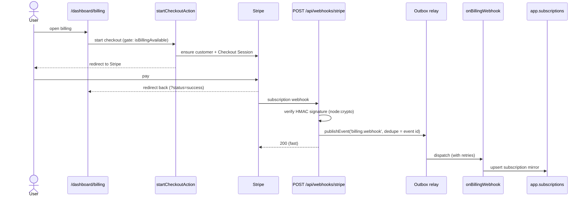

# Billing (Stripe)

Subscription billing behind a thin **seam** — a fetch-based Stripe client, local
mirror tables kept in sync by **webhooks routed through the outbox** — that is
**fully optional**: with the gate off it leaves no dead UI, no dead links, and no
running code.

## Overview

Billing is reached through one client (`@/lib/billing/stripe`, no Stripe SDK) and
one webhook handler (`onBillingWebhook`). Stripe owns billing state; the local
`app.billing_customers` / `app.subscriptions` tables are a read-mirror for fast
access checks. A checkout flow and a self-service billing portal live at
`/dashboard/billing`.

A single gate, `isBillingAvailable()` (`@/lib/billing/availability`), decides
whether billing surfaces at all. It is true only when billing is **both**:

- **configured** — `isBillingConfigured()`: `STRIPE_SECRET_KEY` and
  `STRIPE_PRICE_ID` are set; and
- **switched on** — the `billing.enabled` feature flag (default `false`), so it
  can roll out gradually.

The gate is consulted in three places, so a project that wants no billing simply
leaves the flag off (the catalogue default):

- the **nav link** (`@/components/site-header`) renders only when billing is
  available — no dead link;
- both **actions** (`startCheckoutAction`, `openBillingPortalAction`) throw
  `ForbiddenError` if the gate is closed;
- the **webhook handler** no-ops when billing is unconfigured (the outbox worker
  has no request context, so it gates on `isBillingConfigured()` alone).

Future projects can leave billing off entirely and ship with no billing surface
or dead code at all.

## How it works



The webhook endpoint only verifies the signature and writes **one outbox row**
(deduped on the Stripe event id), then returns `200` immediately. The
[outbox relay](./events.md) processes it with retries, so a slow handler or a
transient DB error never makes Stripe think delivery failed, and a re-delivered
event is processed at most once. On a subscription change the handler also drops
the user's cached billing reads (`invalidateTags`).

## Key files

| Concern                   | Path                                               |
| ------------------------- | -------------------------------------------------- |
| Availability gate         | `@/lib/billing/availability`                       |
| Stripe client (fetch)     | `@/lib/billing/stripe`                             |
| Signature verification    | `@/lib/billing/webhook` (`verifyStripeSignature`)  |
| Webhook route             | `@/app/api/webhooks/stripe/route.ts`               |
| Webhook handler           | `@/server/events/handlers.ts` (`onBillingWebhook`) |
| Mirror tables DAL         | `@/features/billing/queries`                       |
| Actions (checkout/portal) | `@/app/dashboard/billing/actions.ts`               |
| Page + panel              | `@/app/dashboard/billing/`                         |
| Nav gate                  | `@/components/site-header`                         |

## Usage

Gate a paid feature on the access-granting subscription:

```ts
import { getActiveSubscription } from '@/features/billing/queries'

const subscription = await getActiveSubscription(userId)
const isPro = subscription !== null
```

In the UI layer, gate billing surfaces on the full availability check:

```ts
import { isBillingAvailable } from '@/lib/billing/availability'

if (await isBillingAvailable()) {
  // render the billing nav link / panel
}
```

## How to extend

1. **Turn billing on.** Set `STRIPE_SECRET_KEY`, `STRIPE_PRICE_ID`, and
   `STRIPE_WEBHOOK_SECRET`, then enable the flag:

   ```bash
   pnpm --filter web flags sync && pnpm --filter web flags enable billing.enabled
   ```

2. **Forward webhooks locally** with the Stripe CLI:

   ```bash
   stripe listen --forward-to localhost:3000/api/webhooks/stripe
   ```

3. **Swap providers.** Re-implement `@/lib/billing/stripe` (the API calls) and
   `onBillingWebhook` (state sync) against another provider. The tables, DAL,
   actions, and UI are unchanged — that is the seam.

## Configuration

| Variable                | Required        | Purpose                                                 |
| ----------------------- | --------------- | ------------------------------------------------------- |
| `STRIPE_SECRET_KEY`     | yes (to enable) | Stripe API key (use `sk_test_…` in dev).                |
| `STRIPE_PRICE_ID`       | yes (to enable) | Recurring price the checkout sells (`price_…`).         |
| `STRIPE_WEBHOOK_SECRET` | yes (webhooks)  | Signing secret for `verifyStripeSignature` (`whsec_…`). |

`isBillingConfigured()` is true once `STRIPE_SECRET_KEY` and `STRIPE_PRICE_ID`
are present; `STRIPE_WEBHOOK_SECRET` is additionally needed for the webhook route
to accept deliveries. The `billing.enabled` flag must also be on for
`isBillingAvailable()` to return true.

## Related docs

- [Events / outbox](./events.md) — reliable webhook processing.
- [Feature flags](./feature-flags.md) — the `billing.enabled` gate.
- [Caching](./caching.md) — the cached billing reads invalidated on change.
- [ADR-0004](./adr/0004-concrete-vendors-behind-seams.md) — concrete vendors
  behind seams.
