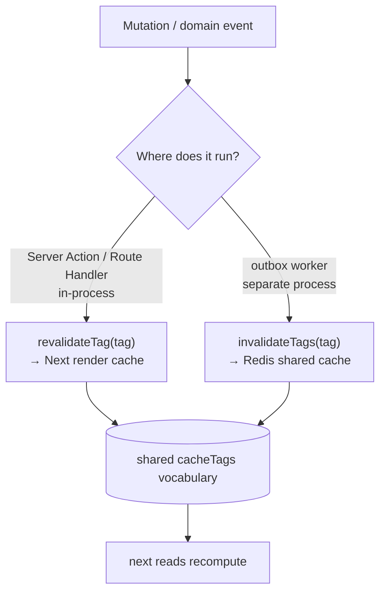

# Caching

Two complementary tiers — Next 16 Cache Components for rendered output and a
Redis read-through cache (`@/lib/cache`) for shared data — keyed by the **same
tag vocabulary**, both degrading safely (the Redis tier no-ops without
`REDIS_URL`).

## Overview

| Tier                  | Caches                             | Lives in                   | Invalidate with       |
| --------------------- | ---------------------------------- | -------------------------- | --------------------- |
| **Render cache**      | rendered Server Component output   | Next.js (Cache Components) | `revalidateTag(...)`  |
| **Shared data cache** | serialized values across instances | Redis (`@/lib/cache`)      | `invalidateTags(...)` |

Because both sides use the same `cacheTags` builders, a single write (or domain
event) can invalidate everything derived from it. Render caching is a Next
built-in; the Redis tier no-ops without `REDIS_URL` (every read becomes the
underlying query, writes/invalidations are no-ops — correct, just uncached).

## How it works

One change can fan out to both tiers. In-process mutations revalidate the render
tag synchronously; cross-process work (the outbox worker) reaches only the Redis
tier — which is exactly what cross-instance freshness needs.



The built-in example is billing: `getActiveSubscription(userId)` is cached under
`cacheKeys.activeSubscription(userId)` and tagged
`cacheTags.userBilling(userId)`. A Stripe subscription event is routed through
the **outbox**, and the `billing.webhook` handler updates the mirror row then
calls `invalidateTags(cacheTags.userBilling(userId))` — so every instance sees
the new state immediately instead of waiting out the TTL.

## Key files

| Concern              | Path                                   |
| -------------------- | -------------------------------------- |
| Redis cache + tags   | `@/lib/cache`                          |
| Redis client (gated) | `@/lib/redis`                          |
| Billing handler      | `@/server/events/handlers.ts`          |
| Render-cache opt-in  | `@/next.config.ts` (`cacheComponents`) |
| Per-render memo      | `@/lib/feature-flags/cache`            |

## Usage

Read-through with the Redis tier:

```ts
import { cached, cacheKeys, cacheTags } from '@/lib/cache'

// Cache hit, or run the loader, store it (TTL + tags), return it.
const subscription = await cached(
  cacheKeys.activeSubscription(userId),
  () => loadSubscriptionFromDb(userId),
  { tags: [cacheTags.userBilling(userId)] }
)
```

Render cache (Cache Components) using the **same** tag builder so one
invalidation covers both tiers:

```ts
import { unstable_cacheTag as cacheTag } from 'next/cache'
import { cacheTags } from '@/lib/cache'

async function BillingSummary({ userId }: { userId: string }) {
  'use cache'
  cacheTag(cacheTags.userBilling(userId))
  const sub = await getActiveSubscription(userId)
  return <Summary subscription={sub} />
}
```

Cache Components are **opt-in**: uncomment `cacheComponents: true` in
[`next.config.ts`](../apps/web/next.config.ts), then wrap every dynamic read
(`cookies()`, `headers()`, `searchParams`) in `<Suspense>` or the build fails.
Adopt it page-by-page.

`@/lib/cache` API:

- `cached(key, loader, opts?)` — read-through. Without Redis it is just
  `loader()`. Caches `null`/`false`/`0` correctly (an envelope distinguishes a
  cached `null` from a miss).
- `cacheGet<T>(key)` / `cacheSet(key, value, opts?)` / `cacheDelete(...keys)` —
  explicit access when read-through doesn't fit.
- `invalidateTags(...tags)` — drop every entry carrying any of the tags.
- `cacheTags` / `cacheKeys` — the shared builders.

`opts`: `ttlSeconds` (default 300; `0` = no expiry) and `tags`. Invalidation is
meant to be precise; the TTL is only a backstop.

`revalidateTag` only affects the Next server that runs it, so call it where the
mutation happens. For mutations that fan out through the outbox worker, rely on
the Redis tier for cross-process invalidation plus short render-cache TTLs (or a
`revalidateTag` in the originating action) for the render tier.

## How to extend (add a cached concern)

1. **Add a key + tag builder** in `@/lib/cache` (`cacheKeys.*`, `cacheTags.*`).
   Always include the user/owner id so per-user data is never cached under a
   shared key.
2. **Read through** with `cached(cacheKeys.X(id), loader, { tags: [cacheTags.X(id)] })`
   at the call site; use the **same** `cacheTag(cacheTags.X(id))` in any
   `'use cache'` render path.
3. **Invalidate on the matching domain event.** In the handler
   (`@/server/events/handlers.ts`) call `invalidateTags(cacheTags.X(id))`; in the
   in-process Server Action that made the change, also `revalidateTag` if a render
   fragment is cached. See `docs/events.md`.

## When to cache what

- **Per-render, request-scoped reuse** (the same flag read many times in one
  render): a tiny in-process memo, like `@/lib/feature-flags/cache` does — no
  Redis round-trip.
- **Cross-request / cross-instance** shared data: `@/lib/cache`.
- **Whole rendered fragments**: Cache Components.

Don't cache anything you can't safely serve stale for the TTL window, and never
cache per-user data under a shared key.

## Configuration

| Env var     | Effect                                                                    |
| ----------- | ------------------------------------------------------------------------- |
| `REDIS_URL` | Enables the shared data tier; unset → `@/lib/cache` no-ops (loader-only). |

The render tier (Cache Components) is a Next built-in and needs no env var, only
the `cacheComponents` opt-in in `next.config.ts`.

## Related docs

- `docs/events.md` — domain events that drive cross-process invalidation.
- `docs/billing.md` — the `billing.webhook` → `userBilling` invalidation example.
- `docs/feature-flags.md` — the two-tier flag cache.
- `docs/adr/0004-concrete-vendors-behind-seams.md` — env-gated vendor seams.
