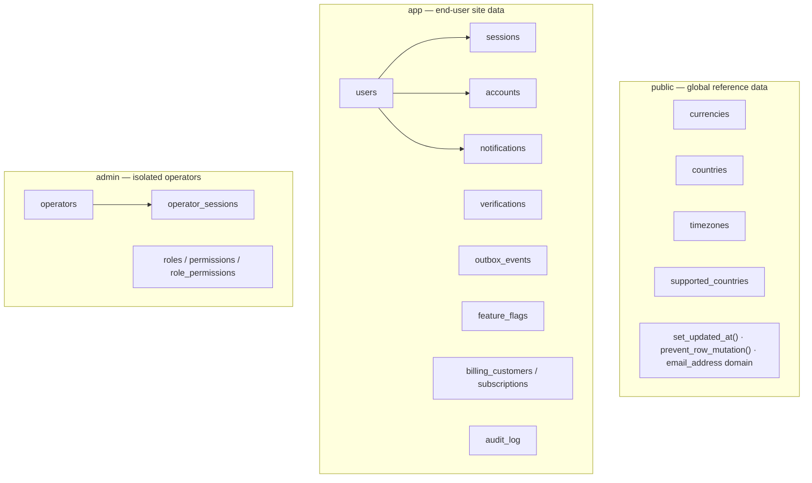
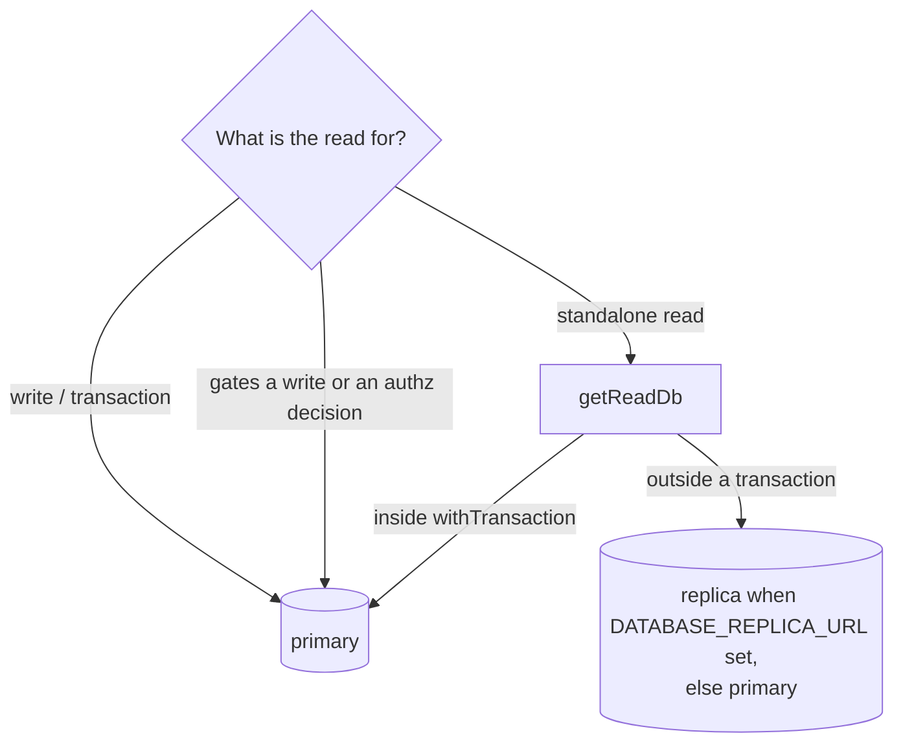

# Database

PostgreSQL accessed through Drizzle ORM for typed queries, with schema changes
applied as hand-written pure-SQL migrations; replicas are pure opt-in (without
`DATABASE_REPLICA_URL` the read client **is** the primary).

## Overview

Three Postgres login roles (least privilege) sit over three schemas — `public`
(global reference data + shared functions), `app` (end-user site data), and
`admin` (isolated operators). DDL is owned by a migration role and shipped as
paired up/down SQL files; the Drizzle schema mirrors them for typed access. Reads
can be routed to a follower, while writes, transactions, and authorization reads
stay on the primary.

## How it works

### Schema overview



### Read-replica routing



## Key files

| Concern            | Path                                            |
| ------------------ | ----------------------------------------------- |
| Migration runner   | `@workspace/db` `src/scripts/migrate.ts`        |
| Migrations         | `packages/db/migrations/NNNNNN_*.{up,down}.sql` |
| Drizzle schema     | `@workspace/db` `src/schema/*`                  |
| Client + accessors | `@workspace/db` `src/client.ts`                 |
| Validated env      | `@workspace/db` `src/env.ts` · `@/env`          |
| Role provisioning  | `infra/postgres/initdb/00-roles.sh`             |

## Migrations

Migrations live in `packages/db/migrations/` as paired files named
`NNNNNN_description.up.sql` / `.down.sql`, applied by a small Node runner
(`packages/db/src/scripts/migrate.ts`, built on `pg` — no external binary).
State is tracked in `public.schema_migrations` and each step runs in its own
transaction; add `-- migrate:no-transaction` as the first line for statements
that cannot (e.g. `CREATE INDEX CONCURRENTLY`). One table (and all of its
indexes, constraints, triggers, and grants) per migration.

| Command                      | Action                                  |
| ---------------------------- | --------------------------------------- |
| `pnpm db:migrate:new <name>` | Scaffold the next numbered up/down pair |
| `pnpm db:migrate`            | Apply all pending migrations            |
| `pnpm db:rollback`           | Roll back the most recent migration     |
| `pnpm db:migrate:status`     | Show the current version                |
| `pnpm sql:lint` / `sql:fix`  | SQLFluff lint / autofix                 |

## Usage

Standalone read off the replica vs. a write inside a transaction:

```ts
import { getReadDb, withTransaction, schema } from '@workspace/db'

// Standalone read — routed to the replica when configured.
const rows = await getReadDb().select().from(schema.users).limit(20)

// Write + audit actor in one atomic transaction (always the primary).
await withTransaction(
  async (tx) => {
    await tx.insert(schema.notifications).values(input)
  },
  { actor: { id: userId, type: 'user' } }
)
```

Three accessors per client (`@workspace/db` and `@workspace/db/admin`):

| Accessor                 | Routes to                           | Use for                   |
| ------------------------ | ----------------------------------- | ------------------------- |
| `db` / `withTransaction` | primary                             | writes, transactions      |
| `getDb()`                | ambient tx if any, else primary     | writes inside DAL helpers |
| `getReadDb()` / `dbRead` | ambient tx if any, else **replica** | standalone reads          |

`getReadDb()` is transaction-aware: inside a `withTransaction` it returns the
primary connection, so **read-your-writes still holds** within a transaction.
Only standalone reads (outside a transaction) hit the replica.

**What stays on the primary, by design** — replicas are asynchronous, so a read
served from one can be slightly stale. Keep these on the primary:

- **Reads that gate a write** in the same operation (e.g. "does this customer
  exist?" before creating one) — staleness there causes duplicates or lost
  writes.
- **Authorization reads** (`getOperatorPermissions`) — a just-revoked permission
  must not linger.
- **Reads feeding a write-through cache** whose invalidation assumes
  read-your-writes (the feature-flag store).

Everything else — listings, detail views, counts, suggestions — uses
`getReadDb()`. Picking the wrong side is never a crash, only a freshness choice;
when in doubt, prefer the primary.

## How to extend

Add a table:

1. `pnpm db:migrate:new create_widgets` and write the `up`/`down` SQL — FKs,
   indexes, an `updated_at` trigger via `public.set_updated_at()`, and role
   grants. Schema-qualify everything (`public.` / `app.` / `admin.`); table names
   are plural. For entity tables add a `deleted_at` column (soft delete).
2. Grant only the verbs the app role needs. The schema-wide
   `ALTER DEFAULT PRIVILEGES` (migration `000002`) already grants `app`
   SELECT/INSERT/UPDATE/DELETE on every future `app` table, so to **withhold** a
   verb you must `REVOKE ALL … FROM app` then `GRANT` back the subset (see
   `app.outbox_events`, below).
3. Mirror the table in `packages/db/src/schema/*` (and `relations.ts` if it has
   FKs) so queries stay typed — including any new indexes / UNIQUE constraints.
4. `pnpm db:migrate`, then `pnpm sql:lint`.

Example `up.sql` body:

```sql
CREATE TABLE app.widgets (
  id uuid PRIMARY KEY DEFAULT gen_random_uuid(),
  user_id text NOT NULL REFERENCES app.users (id) ON DELETE CASCADE,
  name text NOT NULL,
  deleted_at timestamptz,
  created_at timestamptz NOT NULL DEFAULT now(),
  updated_at timestamptz NOT NULL DEFAULT now()
);

CREATE INDEX widgets_user_idx ON app.widgets (user_id) WHERE deleted_at IS null;

CREATE TRIGGER widgets_set_updated_at BEFORE UPDATE ON app.widgets
FOR EACH ROW EXECUTE FUNCTION public.set_updated_at();

DO $$
BEGIN
  IF EXISTS (SELECT 1 FROM pg_roles WHERE rolname = 'app') THEN
    GRANT SELECT, INSERT, UPDATE, DELETE ON app.widgets TO app;
  END IF;
END;
$$;
```

## Reference data

`currencies` (ISO 4217), `countries` (ISO 3166), and `timezones` (canonical
IANA, linked to their country) are generated from maintained npm packages into
migrations `000003`–`000005` and made **immutable** at the database level
(a `prevent_row_mutation()` trigger + read-only grants). Regenerate with
`pnpm db:reference:generate`. `supported_countries` is the mutable opt-in
availability table — empty means "available everywhere".

## Shared objects

Migration `000002` creates the `set_updated_at()` trigger function, the
`prevent_row_mutation()` guard, and the `email_address` domain (validated,
case-insensitive `citext`) reused by every account table.

## Sessions tables (no-Redis fallback)

`app.sessions` (migration `000025`) and `admin.operator_sessions` (`000026`)
exist as the **session fallback** for environments without Redis. In production
sessions live exclusively in Redis (BetterAuth `secondaryStorage`); when
`REDIS_URL` is unset, BetterAuth falls back to its primary Drizzle adapter and
persists sessions in these tables instead. Both are mirrored in the Drizzle
schema (`src/schema/auth.ts`, `src/schema/admin.ts`).

## Outbox DELETE is revoked from `app`

`app.outbox_events` (migration `000020`) is the one `app` table where the app
role **cannot** `DELETE`: the migration `REVOKE ALL … FROM app` then
`GRANT SELECT, INSERT, UPDATE`. Retention pruning of `processed` rows runs as the
table owner via the `app.prune_outbox_events(interval)` `SECURITY DEFINER`
function (the same pattern guards `app.prune_audit_logs`). See `docs/events.md`.

## Roles (least privilege)

`infra/postgres/initdb/00-roles.sh` provisions three login roles, each used by a
different concern:

| Role            | Connection string        | Rights                             |
| --------------- | ------------------------ | ---------------------------------- |
| `app_migrator`  | `MIGRATION_DATABASE_URL` | Owns DDL; runs migrations          |
| `app`           | `DATABASE_URL`           | DML on the `app` user tables       |
| `admin_service` | `ADMIN_DATABASE_URL`     | DML on the isolated `admin` schema |

In single-role development every URL can point at one superuser; the migration
grants are guarded so they no-op when a role is absent.

## Configuration

| Env var                      | Purpose                                                 |
| ---------------------------- | ------------------------------------------------------- |
| `DATABASE_URL`               | App-role connection (DML on `app`).                     |
| `MIGRATION_DATABASE_URL`     | Migration-role connection (owns DDL).                   |
| `ADMIN_DATABASE_URL`         | `admin_service`-role connection (DML on `admin`).       |
| `DATABASE_REPLICA_URL`       | Optional follower for `getReadDb()`; else uses primary. |
| `ADMIN_DATABASE_REPLICA_URL` | Optional follower for the admin read client.            |
| `REDIS_URL`                  | When unset, sessions persist to the fallback tables.    |

## Multi-tenancy

Single-tenant by default. To serve isolated tenants from one deployment, choose
shared-schema + Postgres RLS or schema-per-tenant — both fit the existing
transaction/audit machinery. `pnpm project:init --multitenancy <rls|schema>`
records the decision and (for `rls`) drops a starter migration. See
`docs/multitenancy.md`.

## Related docs

- `docs/events.md` — the transactional outbox and its retention/REVOKE.
- `docs/jobs.md` — the scheduled retention sweep that prunes `processed` rows.
- `docs/multitenancy.md` — tenant-isolation options.
- `docs/adr/0004-concrete-vendors-behind-seams.md` — env-gated vendor seams.
