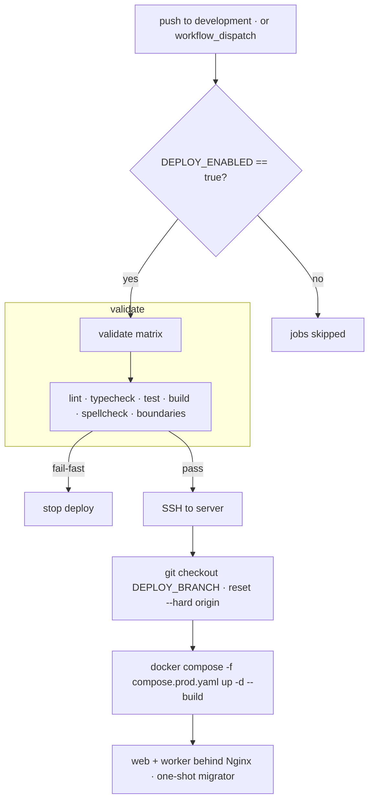

# Deployment

Two targets — GitHub Codespaces for previews and a VPS over SSH for production —
both configured entirely through repository settings, so forks customize without
editing the workflow files.

## Overview

| Target                | When               | How                                     | Status                  |
| --------------------- | ------------------ | --------------------------------------- | ----------------------- |
| **GitHub Codespaces** | now — preview/demo | the dev container; run `pnpm dev`       | ready out of the box    |
| **VPS (Docker)**      | production         | `.github/workflows/deploy.yml` over SSH | **disabled** by default |

The deploy workflow is dormant until you opt in, so an unconfigured repo (no VPS
yet) never produces a red ❌ — the jobs simply show as _skipped_ (gated on the
`DEPLOY_ENABLED` repository variable).

## How it works

`deploy.yml` triggers on **push to `development`** (hardcoded) and on
`workflow_dispatch`. It first re-runs the full quality gate on the exact commit,
then SSHes into the server and brings up the production compose stack. The
`DEPLOY_BRANCH` variable does **not** change the trigger — it controls which
branch is checked out _on the server_.



## Key files

| Concern                    | Path                                 |
| -------------------------- | ------------------------------------ |
| Deploy workflow            | `.github/workflows/deploy.yml`       |
| Dev container (Codespaces) | `.devcontainer/`                     |
| Dev container CI           | `.github/workflows/devcontainer.yml` |
| Production stack           | `compose.prod.yaml`                  |
| Env template               | `infra/docker/.env.example`          |

## GitHub Codespaces (preview, available now)

The dev container (`.devcontainer/`) is what Codespaces runs, so a Codespace
boots the app next to Postgres, Redis and Adminer with insecure dev secrets
already wired in — no setup required to see it run.

1. **Create** — repo, **Code, Codespaces, Create codespace**, or use the badge in
   the README. `postCreateCommand` runs `pnpm install` while it builds.
2. **Prepare the database and run** — in the Codespace terminal:

   ```bash
   pnpm db:migrate
   pnpm db:seed                                   # optional sample data
   pnpm admin:create-operator --email you@example.com --name "You" --super
   pnpm dev
   ```

3. **Open the preview** — the `web` port (3000) forwards automatically and opens
   a preview tab. To share a temporary public URL (for a demo or a webhook),
   right-click the port in the **Ports** panel and set **Port Visibility,
   Public**.
4. **Real credentials (optional)** — to exercise Resend, S3, OAuth, etc. from a
   Codespace, add them as **Codespaces secrets** (repo, Settings, Secrets and
   variables, Codespaces); they arrive as environment variables.

Codespaces is for previews, demos and dev — not production traffic. A CI job
(`devcontainer.yml`) rebuilds the dev container when its definition changes so
this path can't silently rot.

## VPS over SSH

On every **push to `development`** (or a manual `workflow_dispatch`),
`deploy.yml`:

1. re-runs the **full quality gate** (`lint`, `typecheck`, `test`, `build`,
   `spellcheck`, `boundaries`) on that exact commit — a fail-fast failure stops
   the deploy;
2. **SSHes** into the server, checks out `DEPLOY_BRANCH` and `reset --hard`s to
   `origin`, then runs `docker compose -f compose.prod.yaml up -d --build`. That
   builds the `web` and `worker` images, runs the one-shot `migrator`, and serves
   the app behind Nginx (see [infrastructure.md](./infrastructure.md)).

### Server prerequisites (one-time)

- A Linux host with **Docker Engine** + the Compose plugin.
- A **deploy user** that can run Docker (in the `docker` group) and owns the
  checkout. Prefer a dedicated, non-root user; restrict the firewall to ports
  `22`, `80`, `443`.
- A **clone of the repo** at `$DEPLOY_PATH`, checked out on the deploy branch,
  with a root `.env` (copy `infra/docker/.env.example`, which now covers every
  `compose.prod.yaml` variable) holding the production secrets. The `.env` lives
  only on the server, never in git.
- Run the first deploy by hand to verify it boots and to issue the TLS
  certificate:

  ```bash
  docker compose -f compose.prod.yaml up -d --build
  docker compose -f compose.prod.yaml run --rm certbot certonly --webroot -w /var/www/certbot -d example.com
  ```

### Enable it (checklist)

1. **Generate a deploy key** (no passphrase) and authorize it on the server:

   ```bash
   ssh-keygen -t ed25519 -f deploy_key -C github-deploy
   ssh-copy-id -i deploy_key.pub deploy@your.server      # or append to authorized_keys
   ssh-keyscan -p 22 your.server                          # value for DEPLOY_SSH_KNOWN_HOSTS
   ```

2. Add the **secrets** and **variables** below (repo, Settings, Secrets and
   variables, Actions).
3. Set the variable `DEPLOY_ENABLED` to `true`.
4. Push to `development` (or run **Actions, Deploy, Run workflow**).

## Configuration

### Variables

| Variable              | Required | Default             | Purpose                                                |
| --------------------- | -------- | ------------------- | ------------------------------------------------------ |
| `DEPLOY_ENABLED`      | ✅       | —                   | Set to `true` to arm the workflow                      |
| `DEPLOY_PATH`         | ✅       | —                   | Absolute path to the checkout on the box               |
| `DEPLOY_BRANCH`       | —        | `development`       | Branch checked out **on the server** (not the trigger) |
| `DEPLOY_COMPOSE_FILE` | —        | `compose.prod.yaml` | Compose file on the server                             |
| `DEPLOY_ENVIRONMENT`  | —        | `development`       | GitHub deployment environment name                     |
| `DEPLOY_URL`          | —        | —                   | Public URL shown on the deployment                     |
| `TURBO_TEAM`          | —        | —                   | Turborepo remote-cache team (optional)                 |

### Secrets

| Secret                   | Required | Default | Purpose                                |
| ------------------------ | -------- | ------- | -------------------------------------- |
| `DEPLOY_SSH_HOST`        | ✅       | —       | Server hostname or IP                  |
| `DEPLOY_SSH_USER`        | ✅       | —       | SSH user                               |
| `DEPLOY_SSH_KEY`         | ✅       | —       | Private key (PEM) for that user        |
| `DEPLOY_SSH_PORT`        | —        | `22`    | SSH port                               |
| `DEPLOY_SSH_KNOWN_HOSTS` | —        | —       | Server public key(s); strongly advised |
| `TURBO_TOKEN`            | —        | —       | Turborepo remote-cache token           |

## How to extend

- **Deploy a different branch / compose file / path** — set `DEPLOY_BRANCH`,
  `DEPLOY_COMPOSE_FILE`, `DEPLOY_PATH`. Note `DEPLOY_BRANCH` only changes what the
  server checks out; the trigger stays `push: development`. To deploy on a
  different push branch you must edit the `on.push.branches` list in `deploy.yml`.
- **Skip a check** — edit the `matrix.task` list in `deploy.yml`.
- **Build in CI, pull on the server** — if you publish images to a registry,
  point the server's compose at `image:` tags and replace the `--build` step; the
  SSH flow stays the same.

### Security notes

- Use key auth only and a **dedicated low-privilege user**. Setting
  `DEPLOY_SSH_KNOWN_HOSTS` pins the host key — without it the workflow trusts the
  key on first connection (a warning is logged).
- The private key is written to the runner's `~/.ssh` for one job and discarded
  when the job ends; secrets never reach the server's shell history.

## Pausing deploys

Delete the `DEPLOY_ENABLED` variable, or set it to anything other than `true`.
Both jobs then skip — nothing is built or shipped.

## Related docs

- [Infrastructure](./infrastructure.md)
- [Database](./database.md)
- [Observability](./observability.md)
