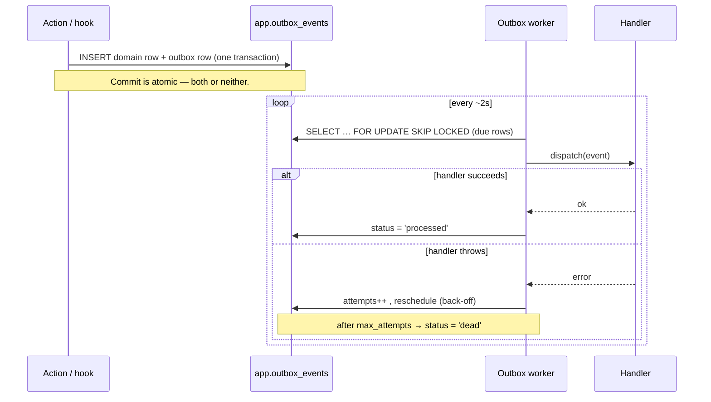

# Domain events (transactional outbox)

The template ships a small, reliable event system based on the **transactional
outbox** pattern. Use it to react to things that happen in your domain (a user
registered, an order was paid, …) **without** doing that work inline in the
request: send an email, write a notification, call a webhook, update analytics.

It is plain PostgreSQL + in-process handlers — **no broker to run**. It
complements `@/lib/jobs` (pg-boss): the outbox is for _domain events you publish
atomically with a DB change_; pg-boss is for _arbitrary deferred work you
enqueue_.

## Why an outbox?

If you send an email directly inside a mutation, two failure modes appear: the
transaction commits but the email fails (lost side effect), or the email sends
but the transaction rolls back (phantom side effect). The outbox removes both:
the event is written **in the same transaction** as the domain change, then a
separate relay delivers it **at least once**.

## How it flows



### State machine

`pending → processing → processed` on success; on failure `→ failed` (retried
with exponential back-off via `scheduled_at`) and finally `→ dead` after
`max_attempts`. Rows are never deleted, so the table doubles as an audit log;
prune `processed` rows on a schedule if it grows.

## Publishing an event

Publish **inside** `withTransaction` so the event commits with your domain
change. `publishEvent` joins the ambient transaction automatically.

```ts
import { publishEvent, withTransaction, schema } from '@workspace/db'

await withTransaction(
  async (tx) => {
    const [order] = await tx.insert(schema.orders).values(input).returning()
    await publishEvent({
      type: 'user.registered',
      userId: order.userId,
      email: user.email,
      name: user.name,
    })
  },
  { actor: { id: user.id, type: 'user' } }
)
```

The catalogue of events lives in
[`packages/db/src/lib/events.ts`](../packages/db/src/lib/events.ts) as a typed
discriminated union (`DomainEvent`). Add a variant, publish it, register a
handler.

## Handling an event

Handlers live in
[`apps/web/server/events/handlers.ts`](../apps/web/server/events/handlers.ts),
one per event type:

```ts
async function onUserRegistered(event: UserRegisteredEvent): Promise<void> {
  await createNotification({
    userId: event.userId,
    type: 'welcome',
    title: `Bienvenue sur ${siteConfig.name} !`,
  })
}

export const eventHandlers: Record<
  DomainEventType,
  (e: DomainEvent) => Promise<void>
> = {
  'user.registered': (e) => onUserRegistered(e as UserRegisteredEvent),
  // …
}
```

**Handlers must be idempotent.** Delivery is _at least once_: a crash between a
side effect and marking the row `processed` will replay the event. Guard with a
natural key, an upsert, or an `idempotency_key`. For slow work (network calls),
enqueue a `@/lib/jobs` job from the handler instead of blocking the relay.

## Running the relay

The relay is a long-lived process, separate from the web server:

```bash
pnpm --filter web worker:outbox
```

It polls `app.outbox_events`, dispatches due rows, and retries failures. Run one
or many instances — `FOR UPDATE SKIP LOCKED` means they never double-process a
row. In production, run it as its own container/service (see the roadmap in
[`docs/ROADMAP.md`](./ROADMAP.md) for a worker Dockerfile).

## Files

| Concern             | File                                                        |
| ------------------- | ----------------------------------------------------------- |
| Table + schema      | `packages/db/migrations/000020_create_outbox_events.up.sql` |
|                     | `packages/db/src/schema/events.ts`                          |
| Catalogue + publish | `packages/db/src/lib/events.ts`                             |
| Handlers            | `apps/web/server/events/handlers.ts`                        |
| Dispatcher          | `apps/web/server/events/dispatch.ts`                        |
| Worker              | `apps/web/server/workers/outbox-worker.ts`                  |
