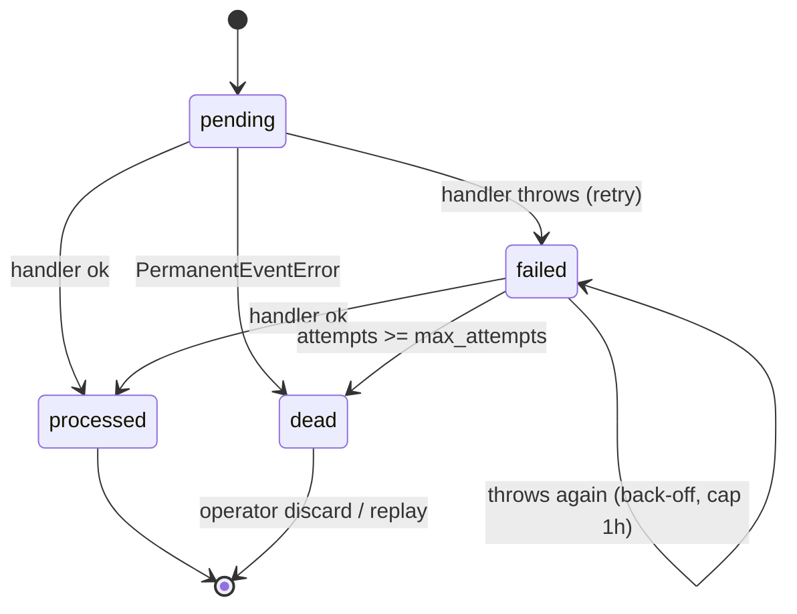

# Domain events (transactional outbox)

A small, reliable event system based on the **transactional outbox** pattern; it
is plain PostgreSQL + in-process handlers (no broker), and without a running
relay events simply queue in `app.outbox_events` until one starts.

## Overview

Use it to react to things that happen in your domain (a user registered, a
subscription changed, …) **without** doing that work inline in the request: send
an email, write a notification, call a webhook, update analytics. The event is
written **in the same transaction** as the domain change, then a separate relay
delivers it **at least once**.

It complements `@/lib/jobs` (pg-boss): the outbox is for _domain events you
publish atomically with a DB change_; pg-boss is for _arbitrary deferred work you
enqueue_. See `docs/jobs.md`.

### Why an outbox?

If you send an email directly inside a mutation, two failure modes appear: the
transaction commits but the email fails (lost side effect), or the email sends
but the transaction rolls back (phantom side effect). The outbox removes both —
the event row and the domain change commit or roll back together.

## How it works

The relay lists due event ids **without a lock**, then claims and processes each
row in **its own short transaction** (`FOR UPDATE SKIP LOCKED` per row). So
handler I/O never holds a lock across the whole batch, and one row's failure
can't roll back the others. Only the **status bookkeeping** is transactional;
the handler's side effects are at-least-once. A crash after a side effect but
before the row is marked `processed` replays the event — so handlers MUST be
idempotent.

```mermaid
sequenceDiagram
    participant A as Action / hook
    participant DB as app.outbox_events
    participant W as Outbox relay
    participant H as Handler

    A->>DB: INSERT domain row + outbox row (one transaction)
    Note over A,DB: Commit is atomic — both or neither.
    loop every poll
        W->>DB: SELECT due ids (no lock)
        loop per id
            W->>DB: BEGIN; claim row FOR UPDATE SKIP LOCKED
            W->>H: dispatch(event)
            alt handler succeeds
                H-->>W: ok
                W->>DB: status = 'processed'; COMMIT
            else handler throws
                H-->>W: error
                W->>DB: attempts++, status = 'failed' (+back-off); COMMIT
                Note over W,DB: PermanentEventError or attempts >= max_attempts → 'dead'
            end
        end
    end
```

### State machine



There is no separate in-flight state: each row is claimed with
`FOR UPDATE SKIP LOCKED` inside its own transaction, so a crash mid-dispatch
rolls back the bookkeeping and the row stays `pending`/`failed` to be retried.
Back-off is exponential (`5s, 10s, 20s …`, capped at **1h**) via `scheduled_at`.
A **`PermanentEventError`** dead-letters immediately (no retry budget burned) —
the relay throws it for an unknown event type, and handlers may throw it for
their own unrecoverable failures. Rows are not deleted inline, so the table
doubles as a short-term log; the retention job prunes `processed` rows on a
schedule and **keeps** `dead` rows for inspection.

## Key files

| Concern             | Path                                                        |
| ------------------- | ----------------------------------------------------------- |
| Table DDL           | `packages/db/migrations/000020_create_outbox_events.up.sql` |
| Drizzle schema      | `@workspace/db` `src/schema/events.ts`                      |
| Catalogue + publish | `@workspace/db` `src/lib/events.ts`                         |
| Dispatcher          | `@/server/events/dispatch.ts`                               |
| Handlers            | `@/server/events/handlers.ts`                               |
| Relay worker        | `@/server/workers/outbox-worker.ts`                         |
| Retention job       | `@/server/jobs/retention.ts`                                |
| Operator DLQ        | `@/features/admin-jobs/queries.ts`                          |

## Usage

Publish **inside** `withTransaction` so the event commits with your domain
change. `publishEvent` joins the ambient transaction automatically.

```ts
import { publishEvent, withTransaction, schema } from '@workspace/db'

await withTransaction(
  async (tx) => {
    const [user] = await tx.insert(schema.users).values(input).returning()
    await publishEvent({
      type: 'user.registered',
      userId: user.id,
      email: user.email,
      name: user.name,
    })
  },
  { actor: { id: userId, type: 'user' } }
)
```

For an external event that may be re-delivered (a Stripe webhook), pass an
`idempotencyKey` so the insert is deduped at the publisher (`onConflictDoNothing`
on the unique `idempotency_key`):

```ts
await publishEvent(event, { idempotencyKey: stripeEventId })
```

Handlers live in `@/server/events/handlers.ts`, one per event type, registered in
the `eventHandlers` record:

```ts
async function onUserRegistered(event: UserRegisteredEvent): Promise<void> {
  await deliverNotification({
    userId: event.userId,
    type: 'welcome',
    // Idempotent: at-least-once delivery + replay must not double-welcome.
    dedupeKey: 'welcome',
    title: `Bienvenue sur ${siteConfig.name} !`,
  })
}
```

**Handlers must be idempotent.** Delivery is _at least once_. Guard with a
natural key or an upsert; notifications take an optional **`dedupeKey`** backed by
a partial unique index (`notifications_dedupe_key_unique`), so a replay is a
no-op instead of a duplicate. For slow work (network calls), enqueue a
`@/lib/jobs` job from the handler rather than blocking the relay.

## How to extend

1. Add a variant to the `DomainEvent` discriminated union in
   `@workspace/db` `src/lib/events.ts` and map it in `aggregateRef` (the
   exhaustive switch forces this).
2. Publish it from the relevant mutation, inside `withTransaction`.
3. Register an idempotent handler in `@/server/events/handlers.ts` under its
   `DomainEventType` key. (An unregistered type dead-letters immediately via
   `PermanentEventError` — no silent loss.)

## Running the relay

The relay is a long-lived process, separate from the web server:

```bash
pnpm --filter web worker:outbox
```

It polls `app.outbox_events`, claims due rows per-row, and retries failures. Run
one or many instances — `FOR UPDATE SKIP LOCKED` means they never double-claim a
row. In production, run it as its own container/service.

### Operator recovery — `/admin/jobs`

Operators inspect the outbox and its dead-letter queue at `/admin/jobs` (PBAC
`jobs.read` / `jobs.write`): **replay** a `failed`/`dead` row (resets to
`pending` with a fresh attempt budget, due now), **replay all dead**, or
**discard** a `dead` row. See `docs/jobs.md`.

## Retention

`processed` rows are pruned by a scheduled job (which also prunes aged audit
rows); `dead` rows are kept. Run it alongside the relay:

```bash
pnpm --filter web worker:jobs
```

It prunes on `RETENTION_CRON`, deleting `processed` events older than
`OUTBOX_RETENTION_DAYS` and audit rows older than `AUDIT_RETENTION_DAYS` via the
`app.prune_outbox_events` / `app.prune_audit_logs` `SECURITY DEFINER` functions —
the `app` role itself has **no DELETE** on `app.outbox_events` (see
`docs/database.md`). One-off sweep: `pnpm --filter web retention:run`.

## Configuration

| Env var                 | Default     | Purpose                                         |
| ----------------------- | ----------- | ----------------------------------------------- |
| `OUTBOX_RETENTION_DAYS` | `30`        | Age past which `processed` events are pruned.   |
| `AUDIT_RETENTION_DAYS`  | `365`       | Age past which audit rows are pruned.           |
| `RETENTION_CRON`        | `0 3 * * *` | Schedule for the retention sweep (worker:jobs). |

## Related docs

- `docs/jobs.md` — pg-boss jobs and the operator DLQ tooling.
- `docs/notifications.md` — `deliverNotification` and the `dedupeKey` index.
- `docs/billing.md` — `billing.webhook` routed through the outbox.
- `docs/database.md` — the outbox table, REVOKE, and prune functions.
- `docs/adr/0004-concrete-vendors-behind-seams.md` — env-gated vendor seams.
