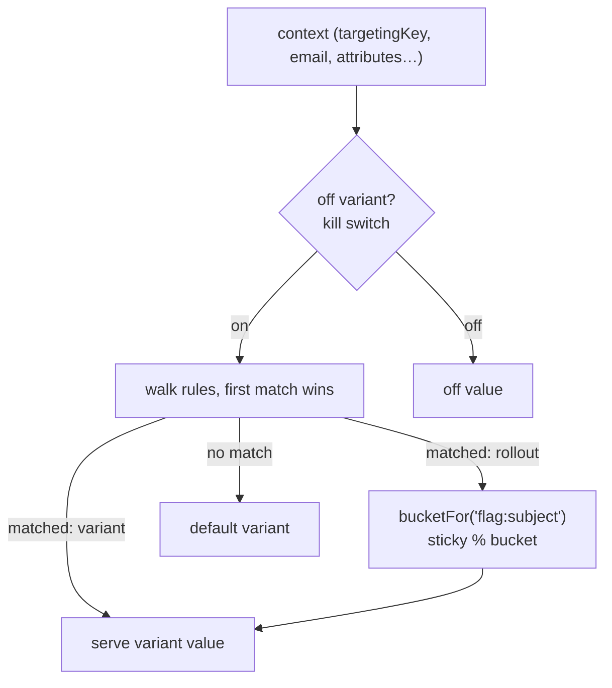
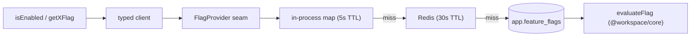

# Feature flags

A DB-backed, Redis-cached feature-flag service that gates features per user (or
any context attribute) with targeting rules and sticky percentage rollouts, and
is **degrade-safe and zero-config**: no DB row ⇒ catalogue default, no
`REDIS_URL` ⇒ in-process cache only, no new environment variables.

## Overview

The decision logic is a pure, well-tested engine, `evaluateFlag`, in
`@workspace/core` (exported from the package root and the
`@workspace/core/feature-flags` subpath). The runtime store
(`app.feature_flags`) sits behind an **OpenFeature-style `FlagProvider` seam**,
so it is swappable (Postgres today, an external service tomorrow) without
touching call sites. Keys, value types, and defaults are checked at compile time
against the catalogue, and a flag check **never throws** — on any error it
returns the catalogue default.

## How it works

Evaluation flow — context resolved to a variant value:



Two-tier cache behind the provider seam:



Cache writes are invalidated on the `feature_flag.changed` event; without
`REDIS_URL` only the in-process tier is active.

## Key files

| Concern         | Path                                                                             |
| --------------- | -------------------------------------------------------------------------------- |
| Pure engine     | `@workspace/core/feature-flags` (`evaluateFlag`)                                 |
| Runtime store   | `app.feature_flags` table                                                        |
| Two-tier cache  | `@/lib/feature-flags/cache.ts` (in-process 5s + Redis 30s)                       |
| Provider seam   | `@/lib/feature-flags/provider.ts` (`DatabaseFlagProvider`, `StaticFlagProvider`) |
| Typed client    | `@/lib/feature-flags/client.ts`                                                  |
| Catalogue       | `@/lib/feature-flags/catalog.ts`                                                 |
| Context builder | `@/lib/feature-flags/context.ts`                                                 |
| Client instance | `@/lib/feature-flags/instance.ts`                                                |
| Management CLI  | `@/server/scripts/flags.ts` (`pnpm --filter web flags …`)                        |

## Usage

```ts
import { isEnabled, getNumberFlag, FeatureGate } from '@/lib/feature-flags'

// In a Server Component / Server Action — evaluated for the current user:
if (await isEnabled('billing.enabled')) {
  /* … */
}
const maxMb = await getNumberFlag('uploads.maxMegabytes')

// As a server-rendered gate:
;<FeatureGate flag="ui.newDashboard" fallback={<LegacyDashboard />}>
  <NewDashboard />
</FeatureGate>
```

`isEnabled('typo')` or `getNumberFlag('billing.enabled')` (wrong type) are
compile-time errors. The evaluation **context** is open: by default it carries
the user's id (`targetingKey`), email, `emailVerified`, and `language`; pass more
via `overrides` as your domain grows:

```ts
await isEnabled('billing.enabled', { attributes: { plan: 'pro' } })
```

## How to extend

1. **Define a flag** in `@/lib/feature-flags/catalog.ts`:

   ```ts
   export const FLAGS = {
     // …
     'ui.newDashboard': boolean(
       false,
       'Opt users into the redesigned dashboard.'
     ),
   } as const satisfies Record<string, FlagSpec>
   ```

   That is enough to use it — with no DB row it resolves to the default
   (`false`).

2. **Tune it at runtime** (enable, target, roll out) by materializing a DB row:

   ```bash
   pnpm --filter web flags sync            # create rows for catalogue flags
   pnpm --filter web flags enable ui.newDashboard
   ```

3. **Target / roll out.** A stored flag has named **variants** (name → value), a
   **default variant**, an **off variant** (kill switch), and an ordered list of
   **rules** (`TargetingRule[]`, first match wins):

   ```jsonc
   [
     // Always on for internal users…
     {
       "conditions": [
         {
           "attribute": "email",
           "operator": "endsWith",
           "values": ["@acme.test"],
         },
       ],
       "outcome": { "kind": "variant", "variant": "enabled" },
     },
     // …and a sticky 20% rollout for everyone else.
     {
       "conditions": [],
       "outcome": {
         "kind": "rollout",
         "weights": { "enabled": 20, "disabled": 80 },
       },
     },
   ]
   ```

   Rollout bucketing is a deterministic hash of `"<flag>:<subject>"`, so a user
   stays in the same bucket as you widen the rollout. Bucket by another attribute
   with `"bucketBy": "orgId"`. Conditions support
   `in`/`notIn`/`equals`/`notEquals`/`contains`/`startsWith`/`endsWith`, numeric
   comparisons, and `exists`/`notExists`; all conditions in a rule are ANDed.

4. **Swap the backend.** Implement `FlagProvider`
   (`@/lib/feature-flags/provider.ts`, one method `resolve(key, context)`) and
   construct the client with it in `@/lib/feature-flags/instance.ts`. The
   catalogue, typed client, server helpers, and `<FeatureGate>` all keep working.

## Management CLI

```bash
pnpm --filter web flags list             # show configured flags
pnpm --filter web flags sync [key]       # create rows for catalogue flags (missing only)
pnpm --filter web flags enable <key>     # flip the kill switch on
pnpm --filter web flags disable <key>    # …off
pnpm --filter web flags remove <key>     # delete a flag's configuration
```

Every write runs in a transaction, **invalidates the cache**, and publishes a
`feature_flag.changed` domain event. The handler records a structured
rollout-metric line — a durable, queryable trail of which flag flipped, by whom,
and when — pairing flags with the [event system](./events.md).

## Configuration

No dedicated env vars. The only optional knob is `REDIS_URL`: when set, the
shared Redis tier is active and instances converge within ~30s of a change;
without it, only the per-instance in-process tier (5s TTL) is used.

## Related docs

- [Events / outbox](./events.md) — the `feature_flag.changed` audit trail.
- [Caching](./caching.md) — the shared Redis tier and tag vocabulary.
- [Billing](./billing.md) — gated on `billing.enabled`.
- [ADR-0004](./adr/0004-concrete-vendors-behind-seams.md) — concrete vendors
  behind seams.
