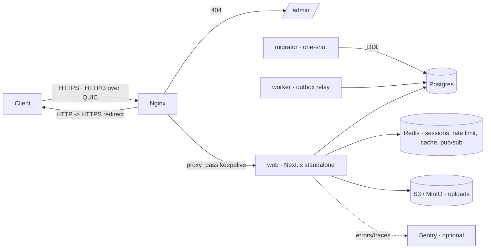

# Infrastructure

Container, reverse-proxy, and database-bootstrap configuration for every
environment, under `infra/` with the Compose files at the repo root.

## Overview

The stack runs the Next.js app as a standalone server behind Nginx, with
Postgres, Redis, and S3-compatible storage as backing services. A one-shot
`migrator` applies migrations and a long-lived `worker` runs the outbox relay —
both built from the same image as `web`. Locally you run only the backing
services in Docker and the app on the host with `pnpm dev`.

## How it works



## Key files

| Concern                  | Path                                      |
| ------------------------ | ----------------------------------------- |
| Local dev services       | `compose.yaml`                            |
| Containerized full stack | `compose.dev.yaml`                        |
| Production stack         | `compose.prod.yaml`                       |
| Web image (multi-stage)  | `infra/docker/web.Dockerfile`             |
| Env template             | `infra/docker/.env.example`               |
| Nginx base config        | `infra/nginx/nginx.conf`                  |
| Nginx server block       | `infra/nginx/conf.d/default.conf`         |
| TLS params               | `infra/nginx/conf.d/ssl.conf`             |
| Role bootstrap           | `infra/postgres/initdb/00-roles.sh`       |
| Extension bootstrap      | `infra/postgres/initdb/01-extensions.sql` |
| Dev container            | `.devcontainer/`                          |

## Compose files

| File                | Use                                                                   |
| ------------------- | --------------------------------------------------------------------- |
| `compose.yaml`      | Local dev: Postgres + Redis + Adminer; run the app with `pnpm dev`    |
| `compose.dev.yaml`  | Full stack in containers (superuser DB role, no proxy)                |
| `compose.prod.yaml` | Production: Nginx -> web + worker, one-shot migrator, least-privilege |

## Usage / commands

```bash
docker compose up -d                               # local db + redis + adminer
docker compose -f compose.dev.yaml up --build      # full containerized stack
cp infra/docker/.env.example .env                  # then edit secrets
docker compose -f compose.prod.yaml up -d --build  # production (web + worker)
docker compose -f compose.prod.yaml up -d --scale worker=2  # more worker replicas
```

## Web image

`infra/docker/web.Dockerfile` is multi-stage. `turbo prune` keeps only `web` and
its workspace dependencies; the build emits Next.js standalone output served by a
non-root user.

| Stage       | Role                                                                                    |
| ----------- | --------------------------------------------------------------------------------------- |
| `base`      | Node 24 Alpine + corepack/pnpm                                                          |
| `pruner`    | `turbo prune web --docker` (lockfile-aware)                                             |
| `installer` | `pnpm install --frozen-lockfile` on the pruned tree                                     |
| `builder`   | `turbo run build --filter=web` (standalone bundle)                                      |
| `migrator`  | one-shot: applies the pure-SQL migrations with the Node runner                          |
| `worker`    | long-lived: defaults to `worker:outbox`; override the command for a pg-boss jobs worker |
| `runner`    | minimal runtime serving `apps/web/server.js` as non-root, with a `HEALTHCHECK`          |

The `migrator` and `worker` stages reuse the `installer` layer (it already has
`tsx`, `pg`, and the sources), so they behave identically in dev and prod.
Migrations run from the `migrator` service, never from the `runner` image.

## Dev container

`.devcontainer/` defines a ready-to-code environment (VS Code "Reopen in
Container", GitHub Codespaces, or the JetBrains Gateway dev containers plugin).
The workspace runs as the `app` service next to Postgres + Redis + Adminer from
`compose.yaml`, so the database is reachable at host `db` and the cache at host
`redis` — both already wired into the container environment. `pnpm install` runs
on first start; then `pnpm db:migrate && pnpm dev` and open
[localhost:3000](http://localhost:3000). The recommended editor extensions
(`.vscode/extensions.json`) are installed into the container automatically.

## Editors

Both major editors are configured out of the box:

- **VS Code** — `.vscode/` ships recommended extensions, format/ESLint-on-save,
  Tailwind + SQLFluff settings, debug launchers and tasks; the dev container
  reuses them.
- **JetBrains** (WebStorm / IntelliJ IDEA) — shared run configurations live in
  `.run/` (Run, dev, build, lint, typecheck, test, check, db:migrate, db:studio,
  docker: local db). Code style is read from `.editorconfig` natively; enable the
  **Prettier** (run on save), **ESLint** (automatic configuration) and **Tailwind
  CSS** plugins to match the VS Code experience.

## Nginx

`infra/nginx/conf.d/default.conf` terminates TLS (TLS 1.2/1.3 + HTTP/3 over
QUIC), redirects HTTP -> HTTPS, sets the baseline security headers, and
reverse-proxies to the web container. It returns `404` for `/admin`, so the
operator console is unreachable from the public internet — to expose it
internally, uncomment the allow-list + proxy block and restrict to your
VPN/office CIDRs. Certificates are issued/renewed by the `certbot` service; TLS
params live in `conf.d/ssl.conf`.

## PostgreSQL bootstrap

`infra/postgres/initdb/` runs once on first init: `00-roles.sh` creates the
least-privilege login roles (`app_migrator`, `app`, `admin_service`) and
`01-extensions.sql` installs extensions (`pgcrypto`, `citext`, `pg_trgm`,
`btree_gin`, `pg_stat_statements`).

## How to extend

- **Add a second worker** — add a service that reuses the `worker` target with a
  different `command` (e.g. `worker:jobs` for the pg-boss retention prune).
- **Expose the admin console internally** — edit
  `infra/nginx/conf.d/default.conf`: replace the `return 404` with the
  allow-list and proxy block, restricted to your VPN/office CIDRs.
- **Add a Postgres extension or role** — extend the `initdb` scripts (they only
  run on a fresh data volume).

## Configuration

See `infra/docker/.env.example` — it covers every variable consumed by
`compose.prod.yaml`. Key variables:

| Variable                               | Purpose                                       |
| -------------------------------------- | --------------------------------------------- |
| `DATABASE_URL`                         | App connection (role `app`)                   |
| `MIGRATION_DATABASE_URL`               | Migration connection (role `app_migrator`)    |
| `ADMIN_DATABASE_URL`                   | Operator connection (role `admin_service`)    |
| `AUTH_USER_SECRET` / `AUTH_USER_URL`   | End-user auth instance                        |
| `AUTH_ADMIN_SECRET` / `AUTH_ADMIN_URL` | Operator auth instance                        |
| `REDIS_URL`                            | Sessions, rate limit, cache, realtime pub/sub |
| `S3_ENDPOINT` / `S3_BUCKET`            | Object storage (S3 / R2 / MinIO)              |
| `NEXT_PUBLIC_APP_URL`                  | Public origin                                 |

Generate secrets with `openssl rand -base64 32` (or let `pnpm project:init` do it).

## Related docs

- [Deployment](./deployment.md)
- [Database](./database.md)
- [Observability](./observability.md)
- `infra/README.md`
