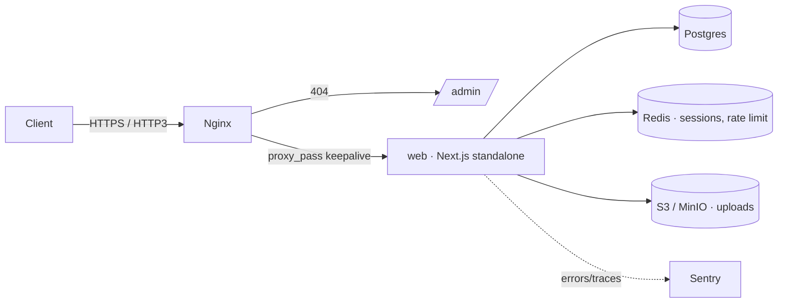

# Infrastructure

All container, reverse-proxy, and database-bootstrap configuration lives under
`infra/`; the Compose files are at the repo root.

## Compose files

| File                | Use                                                         |
| ------------------- | ----------------------------------------------------------- |
| `compose.yaml`      | Local dev: Postgres + Adminer; run the app with `pnpm dev`  |
| `compose.dev.yaml`  | Full stack in containers (superuser DB role, no proxy)      |
| `compose.prod.yaml` | Production: Nginx → web, one-shot migrator, least-privilege |

```bash
docker compose up -d                               # local database
docker compose -f compose.dev.yaml up --build      # full containerized stack
cp infra/docker/.env.example .env                  # then edit secrets
docker compose -f compose.prod.yaml up -d --build  # production
```

## Dev container

`.devcontainer/` defines a ready-to-code environment (VS Code "Reopen in
Container", GitHub Codespaces, or the JetBrains Gateway dev containers plugin).
The workspace runs as the `app` service next to Postgres + Redis + Adminer from
`compose.yaml`, so the database is reachable at host `db` and the cache at host
`redis` — both already wired into the container environment. `pnpm install` runs
on first start; then `pnpm db:migrate && pnpm dev` and open
[localhost:3000](http://localhost:3000). The recommended editor extensions
(`.vscode/extensions.json`) are installed into the container automatically.

## Web image

`infra/docker/web.Dockerfile` is multi-stage: `turbo prune` → install → build →
a minimal `runner` stage serving Next.js standalone output as a non-root user.
Migrations run from the `migrator` stage of the same Dockerfile — the `migrator`
service applies them with the Node runner — not from the app `runner` image.

## Nginx

`infra/nginx/conf.d/default.conf` terminates TLS (TLS 1.2/1.3 + HTTP/3 over
QUIC), redirects HTTP→HTTPS, sets the baseline security headers, and
reverse-proxies to the web container. It returns `404` for `/admin`, so the
operator console is unreachable from the public internet — to expose it
internally, uncomment the allow-list + proxy block and restrict to your
VPN/office CIDRs. Certificates are issued/renewed by the `certbot` service;
TLS params live in `conf.d/ssl.conf`.



## PostgreSQL

`infra/postgres/initdb/` runs once on first init: `00-roles.sh` creates the
least-privilege login roles (`app_migrator`, `app`, `admin_service`) and
`01-extensions.sql` installs extensions (`pgcrypto`, `citext`, `pg_trgm`,
`btree_gin`, `pg_stat_statements`).

## Environment

See `infra/docker/.env.example`. Key variables:

| Variable                               | Purpose                                    |
| -------------------------------------- | ------------------------------------------ |
| `DATABASE_URL`                         | App connection (role `app`)                |
| `MIGRATION_DATABASE_URL`               | Migration connection (role `app_migrator`) |
| `ADMIN_DATABASE_URL`                   | Operator connection (role `admin_service`) |
| `AUTH_USER_SECRET` / `AUTH_USER_URL`   | End-user auth instance                     |
| `AUTH_ADMIN_SECRET` / `AUTH_ADMIN_URL` | Operator auth instance                     |
| `NEXT_PUBLIC_APP_URL`                  | Public origin                              |

Generate secrets with `openssl rand -base64 32` (or let `pnpm project:init` do it).
