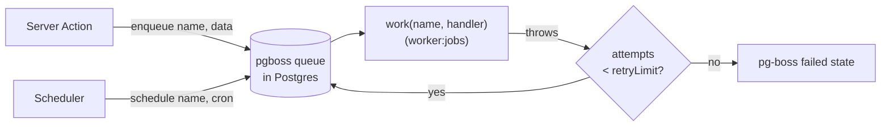
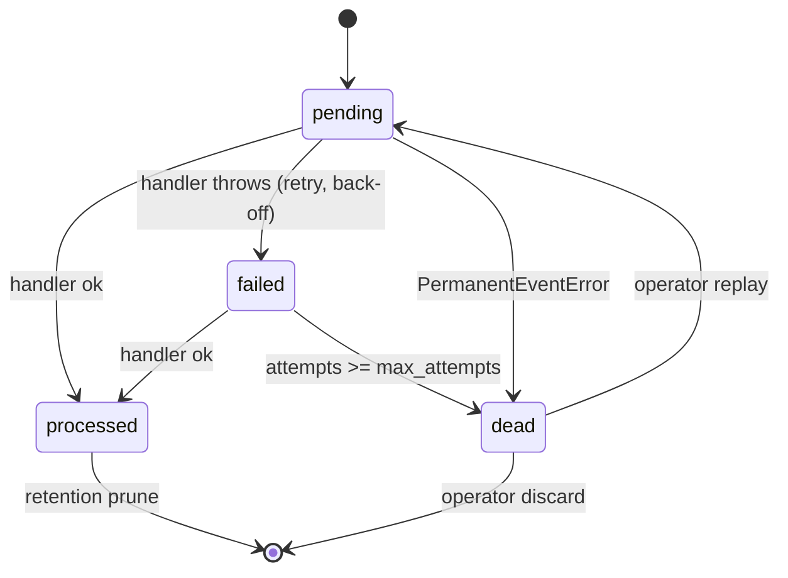

# Background jobs & the dead-letter queue

Two complementary mechanisms move work off the request path — pg-boss jobs and
the transactional outbox — plus an operator dashboard to watch and recover them;
both run on PostgreSQL with no extra infrastructure.

## Overview

- **`@/lib/jobs` (pg-boss)** — arbitrary deferred work you `enqueue`, processed
  by `work(...)` handlers in a long-lived worker. pg-boss owns retries,
  concurrency and scheduling, all in PostgreSQL (it self-manages its own `pgboss`
  schema and reuses `DATABASE_URL`).
- **Transactional outbox** — domain events published atomically with a DB change
  and delivered at-least-once by the outbox relay. See `docs/events.md`.

Operators inspect both — pg-boss queue backlogs and the outbox dead-letter queue,
with replay/discard — at `/admin/jobs`.

## How it works



### DLQ state machine (outbox)



The outbox is the dead-letter machine: a row goes `dead` once it exhausts
`max_attempts` (or hits a `PermanentEventError`). The retention job deliberately
keeps `dead` rows (it only prunes `processed`), so nothing is lost silently. The
same notation is used in `docs/events.md`.

## Key files

| Concern               | Path                                |
| --------------------- | ----------------------------------- |
| pg-boss seam          | `@/lib/jobs`                        |
| Scheduled-jobs worker | `@/server/workers/jobs-worker.ts`   |
| Retention job         | `@/server/jobs/retention.ts`        |
| Outbox relay worker   | `@/server/workers/outbox-worker.ts` |
| Operator DLQ queries  | `@/features/admin-jobs/queries.ts`  |
| Outbox dispatcher     | `@/server/events/dispatch.ts`       |

## Usage

Enqueue from a Server Action, then `work`/`schedule` in a long-lived worker:

```ts
// In a Server Action — fire-and-forget off the request path.
import { enqueue } from '@/lib/jobs'

await enqueue('email.welcome', { userId })
```

```ts
// In a worker entrypoint (run as its own process).
import { ensureQueue, work, schedule } from '@/lib/jobs'

await ensureQueue('email.welcome')
await work<{ userId: string }>('email.welcome', async ({ userId }) => {
  await sendWelcomeEmail(userId)
})

// A recurring job (idempotent by queue name) with an explicit retry policy.
await schedule(
  'email.welcome',
  '0 * * * *',
  {},
  { retryLimit: 3, retryDelay: 60, retryBackoff: true }
)
```

The built-in scheduled job is the **retention sweep** (`RETENTION_QUEUE`,
`@/server/jobs/retention.ts`). pg-boss defaults to 2 retries with no delay; the
sweep overrides this with an explicit policy — `retryLimit: 3`, `retryDelay: 60`
(seconds), `retryBackoff: true` — so a transient blip on the DB-heavy prune backs
off instead of hammering. Run the worker with:

```bash
pnpm --filter web worker:jobs
```

## How to extend

1. Pick a stable queue name (e.g. `report.generate`).
2. `enqueue(name, data, options?)` from the action/route that triggers the work —
   keep `data` small and serializable.
3. In a worker process, `ensureQueue(name)` then `work(name, handler, options?)`.
   For recurring work add `schedule(name, cron, data, options?)` and pass an
   explicit retry policy.
4. Surface failures: rethrow from the handler so pg-boss records/retries them
   (the retention worker rethrows after `reportError`).

## The operator dashboard — `/admin/jobs`

A console page (PBAC: `jobs.read` to view, `jobs.write` to act) that shows:

- **Outbox tiles** — counts of `pending`, `failed` (retrying), `dead`
  (exhausted) and `processed` rows.
- **pg-boss queues** — each queue's `queued` / `active` / `deferred` / `total`
  backlog (`listQueueStates()` in `@/lib/jobs`).
- **The dead-letter queue** — every `failed` and `dead` outbox row with its
  event type, attempts, last error and failure time.

### Recovering events

From the DLQ, an operator with `jobs.write` can:

- **Replay** a `failed` or `dead` row (`replayOutboxEvent`) — resets it to
  `pending` with a fresh attempt budget (`attempts = 0`) and makes it due now, so
  the outbox worker re-delivers it. Scoped to `failed`/`dead` rows. Handlers are
  idempotent, so a replay is safe.
- **Replay all dead** (`replayAllDeadEvents`) — re-queue every dead row at once.
- **Discard** a `dead` row (`discardDeadEvent`) — permanently delete it once
  you've decided it should never be delivered (e.g. a malformed legacy event).
  Only `dead` rows can be discarded; a still-retrying `failed` row is left to the
  worker.

The replay/discard logic lives in `@/features/admin-jobs/queries.ts` and is
invoked by `jobs.write`-gated Server Actions; the worker
(`pnpm --filter web worker:outbox`) does the actual redelivery.

### Before replaying

A row reached the DLQ because its handler kept throwing. Replaying without fixing
the cause just sends it back to `dead`. Read `errorMessage`, fix the handler (or
the bad data), deploy, **then** replay.

## Configuration

| Env var          | Default     | Purpose                                     |
| ---------------- | ----------- | ------------------------------------------- |
| `DATABASE_URL`   | —           | pg-boss reuses this; no separate job store. |
| `RETENTION_CRON` | `0 3 * * *` | Schedule for the retention sweep.           |

## Related docs

- `docs/events.md` — the transactional outbox and its state machine.
- `docs/observability.md` — error reporting and tracing around jobs.
- `docs/database.md` — the outbox table and prune functions.
- `docs/adr/0004-concrete-vendors-behind-seams.md` — env-gated vendor seams.
