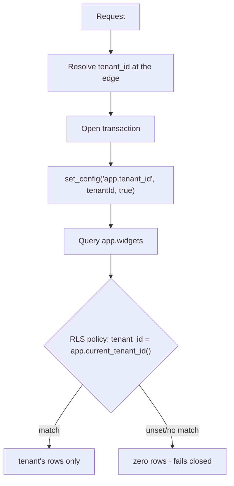

# Multi-tenancy

The template ships single-tenant by default; when you need to serve multiple
isolated customers from one deployment, pick shared-schema + RLS or
schema-per-tenant — both fit the existing architecture.

## Overview

`pnpm project:init --multitenancy <rls|schema>` records the decision in
`PROJECT.md` and, for `rls`, drops a starter migration. You can also adopt either
pattern by hand later — nothing here is load-bearing until you opt in.

| Pattern                 | Isolation         | Ops cost | Best for                                        |
| ----------------------- | ----------------- | -------- | ----------------------------------------------- |
| **Shared schema + RLS** | Row-level (DB)    | Low      | Many small/medium tenants, B2B SaaS             |
| **Schema-per-tenant**   | Schema-level (DB) | Medium   | Fewer, larger tenants; per-tenant export/backup |

> A third option — a separate **database (or cluster) per tenant** — is the
> strongest isolation and the highest ops cost. It needs no app changes beyond
> routing a request to the right `DATABASE_URL`; treat it as an extension of the
> read-replica routing already in `@workspace/db`.

## How it works

With RLS, the request resolves a tenant at the edge, stamps it transaction-local
with `set_config('app.tenant_id', …, true)`, and every policy reads it back
through `app.current_tenant_id()` to filter rows in the database — even if a
query forgets the `WHERE tenant_id = …`.



## Shared schema + Row-Level Security (recommended default)

Every tenant-scoped row carries a `tenant_id`, and PostgreSQL **Row-Level
Security (RLS)** enforces that a connection only ever sees its own tenant's rows.
The guarantee lives in the database, not in application discipline.

### What the scaffold creates

`--multitenancy rls` drops a migration
(`packages/db/migrations/<n>_multitenancy_scaffold.up.sql`) that creates **only**:

- the `app.tenants` table (with `set_updated_at` trigger and soft-delete column);
- the `app.current_tenant_id()` helper function;
- `GRANT`s of those to the `app` role.

```sql
CREATE TABLE app.tenants (
  id uuid PRIMARY KEY DEFAULT gen_random_uuid(),
  name text NOT NULL,
  created_at timestamptz NOT NULL DEFAULT now(),
  updated_at timestamptz NOT NULL DEFAULT now(),
  deleted_at timestamptz
);

-- The current request's tenant, set per transaction. NULL when unset.
CREATE FUNCTION app.current_tenant_id() RETURNS uuid
LANGUAGE sql STABLE AS $$
  SELECT nullif(current_setting('app.tenant_id', true), '')::uuid;
$$;
```

It does **not** enable RLS or `FORCE` on any of your tables — the migration ships
those statements only as commented examples. You add the `tenant_id` column, the
`ENABLE`/`FORCE ROW LEVEL SECURITY`, and the policy to each tenant-scoped table
yourself, then mirror the change in the Drizzle schema:

```sql
ALTER TABLE app.widgets ADD COLUMN tenant_id uuid NOT NULL REFERENCES app.tenants (id);
CREATE INDEX widgets_tenant_idx ON app.widgets (tenant_id);

ALTER TABLE app.widgets ENABLE ROW LEVEL SECURITY;
ALTER TABLE app.widgets FORCE ROW LEVEL SECURITY;   -- applies to the table owner too
CREATE POLICY widgets_tenant_isolation ON app.widgets
  USING (tenant_id = app.current_tenant_id())
  WITH CHECK (tenant_id = app.current_tenant_id());
```

RLS applies to the non-owning `app` role; `FORCE` extends it to the owner
(`app_migrator`) so nothing escapes the policy. The migration role still bypasses
RLS for DDL, which is what you want.

### Setting the tenant per request

The template already sets a transaction-local setting for the **audit actor**
(`app.actor_id`, see `packages/db/src/lib/transaction.ts`). Tenant context works
the same way. The cleanest seam is a `withTenantTransaction(tenantId, fn, opts)`
that wraps `withTransaction` and runs one extra `set_config`:

```ts
await tx.execute(sql`select set_config('app.tenant_id', ${tenantId}, true)`)
```

Resolve `tenantId` once at the edge — from the authenticated user's `tenant_id`,
a subdomain, or a path segment — and thread it into every mutation/read
transaction. Because the policy defaults to "no rows" when `app.tenant_id` is
unset, a forgotten stamp fails closed.

### Gotchas

- **Connection pooling.** `set_config(…, true)` is transaction-local, so it
  resets at COMMIT/ROLLBACK and never leaks across pooled connections — the same
  property the audit actor relies on. Never use the session-level form.
- **Unique constraints** must include `tenant_id` (e.g. `UNIQUE (tenant_id,
slug)`), or tenants collide.
- **Reference data** (`public.currencies`, …) is global — leave it un-tenanted.
- **The admin system** is already isolated and is not tenant-scoped; operators
  manage all tenants.
- **Read replicas** inherit RLS, so `getReadDb()` is unaffected — just stamp the
  tenant inside the transaction as usual.

## Schema-per-tenant

Each tenant gets its own PostgreSQL schema (`tenant_acme.*`, `tenant_beta.*`)
with an identical table layout. A request selects the tenant's schema by setting
`search_path` (or qualifying every table) per transaction.

- **Provisioning** is dynamic: on tenant creation, run the table DDL inside a new
  schema (a templated migration applied with the schema name substituted). Keep
  the DDL in one place so every tenant schema stays in lockstep.
- **Routing**: `set_config('search_path', 'tenant_acme, public', true)` at the
  start of the transaction, mirroring the tenant-stamp approach above.
- **Trade-offs**: stronger blast-radius isolation and trivial per-tenant
  export/drop, but migrations must fan out over N schemas and the catalog grows
  with tenant count — painful past a few hundred tenants.

Prefer RLS unless you have a concrete reason (regulatory isolation, per-tenant
backup/restore, very few large tenants) to take on the per-schema ops cost.

## Key files

| Concern                                     | Path                                                             |
| ------------------------------------------- | ---------------------------------------------------------------- |
| Tenancy decision + scaffold                 | `scripts/init-project.ts`                                        |
| Transaction-local actor (pattern to mirror) | `packages/db/src/lib/transaction.ts`                             |
| Scaffold migration output                   | `packages/db/migrations/<n>_multitenancy_scaffold.{up,down}.sql` |
| Drizzle schema (mirror changes here)        | `packages/db/src/schema/`                                        |

## Usage / commands

```bash
pnpm project:init --multitenancy rls       # scaffold app.tenants + helper, record in PROJECT.md
pnpm project:init --multitenancy schema    # record schema-per-tenant decision
pnpm db:migrate                            # apply the scaffold migration (rls)
```

## How to extend

- **Per-table isolation** — add `tenant_id` + the RLS policy (above) to each
  tenant-scoped table, mirror in the Drizzle schema, then `pnpm db:migrate`.
- **Per-request stamping** — add `withTenantTransaction` next to
  `withTransaction` and resolve the tenant at the edge.
- **Move a heavy tenant** — promote it to its own schema or database later; the
  patterns compose.

## Related docs

- [Database](./database.md)
- [Authentication](./auth.md)
- [Infrastructure](./infrastructure.md)
