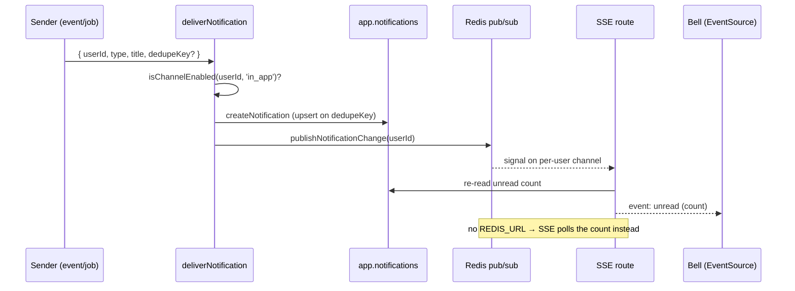

# Notifications

In-app notifications for end users with a **live unread badge**, an inbox, and
per-channel preferences; realtime updates use Server-Sent Events backed by Redis
pub/sub, degrading to **polling** when `REDIS_URL` is absent.

## Overview

Notifications live in `app.notifications` (+ a DAL) and are delivered through
`deliverNotification`, which respects the user's channel preference and pushes a
realtime signal. A bell renders the unread count; an inbox marks read / deletes
and exposes per-channel toggles backed by `app.notification_preferences`.

Delivery is **idempotent**: callers that may run more than once (event handlers,
job retries) pass a `dedupeKey`. A partial unique index on
`app.notifications (user_id, dedupe_key) WHERE dedupe_key IS NOT NULL` makes a
re-delivery a no-op instead of a duplicate row.

## How it works



The web app and the outbox worker run as **separate processes**, so Redis
pub/sub is what bridges a delivery in the worker to an open SSE connection in the
web app. Without `REDIS_URL`, `publishNotificationChange` is a no-op and the SSE
route falls back to periodic polling.

## Key files

| Concern               | Path                                                          |
| --------------------- | ------------------------------------------------------------- |
| DAL (+ dedupe upsert) | `@/features/notifications/queries.ts`                         |
| Delivery (gated)      | `@/features/notifications/service.ts` (`deliverNotification`) |
| Channels + helpers    | `@/features/notifications/channels.ts` (client-safe, pure)    |
| Preferences DAL       | `@/features/notifications/preferences.ts`                     |
| Realtime pub/sub      | `@/lib/notifications-stream.ts`                               |
| SSE endpoint          | `@/app/api/notifications/stream/route.ts`                     |
| Bell                  | `@/components/notification-bell.tsx`                          |
| Inbox + preferences   | `@/app/dashboard/notifications/`                              |
| Table + index         | `packages/db/migrations/000018_create_notifications.up.sql`   |

## Usage

Prefer `deliverNotification` over the raw DAL insert — it honors the channel
preference and pushes a realtime signal. Pass a `dedupeKey` from any caller that
can run twice:

```ts
import { deliverNotification } from '@/features/notifications/service'

await deliverNotification({
  userId,
  type: 'order.shipped',
  title: 'Your order shipped',
  body: 'Track it from your dashboard.',
  data: { orderId },
  dedupeKey: `order.shipped:${orderId}`, // re-delivery is a no-op
})
// → inserts only if the user's `in_app` channel is enabled, then publishes a
//   change so open inboxes/bells update live. Returns null when skipped/deduped.
```

`isChannelEnabled(userId, channel)` is the gate senders consult; a missing
preference row means **enabled**.

## How to extend

1. **Add a channel.** Add it to `channels.ts` (currently `in_app`, `email`); the
   value is stored per `(user, channel)` in `app.notification_preferences` and a
   missing row defaults to enabled.
2. **Gate the sender** on `isChannelEnabled(userId, '<channel>')` before
   dispatching (`deliverNotification` does this for `in_app`; email senders check
   `'email'`).
3. **Expose a toggle** in the inbox preferences UI
   (`@/app/dashboard/notifications/`) so users can opt out.
4. **Make delivery idempotent** by passing a stable `dedupeKey` whenever the
   caller (event handler, job) can run more than once.

## Related docs

- [Events / outbox](./events.md) — handlers that fan out to notifications.
- [Jobs](./jobs.md) — background senders and retries (why `dedupeKey` matters).
- [Caching](./caching.md) — Redis is shared with pub/sub here.
- [ADR-0004](./adr/0004-concrete-vendors-behind-seams.md) — concrete vendors
  behind seams.
