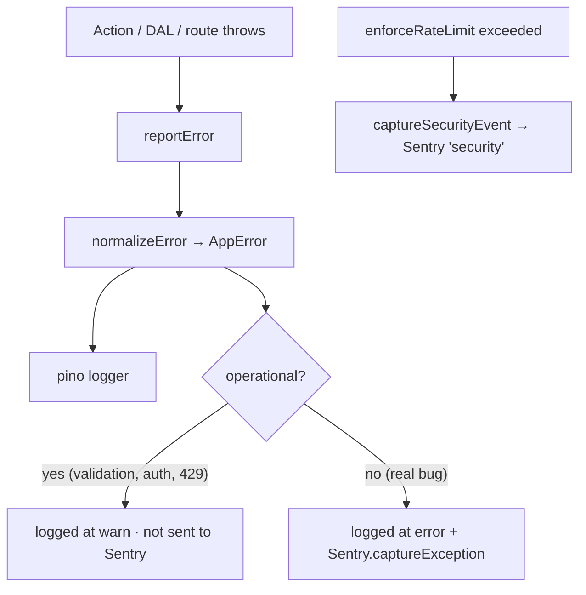

# Observability — logging & error tracking

Two layers, one choke-point. Structured logs (pino) capture everything; Sentry
captures the bugs and security signals worth alerting on. Both are wired so call
sites never change and so the template runs fine with neither account
configured.

## The choke-point

Every server-side error goes through `reportError` (`@/lib/observability`).
It normalizes the throwable to an `AppError`, logs it, and forwards genuine
bugs to Sentry:

Operational errors (validation, unauthorized, rate-limit) are _expected_ — they
are logged at `warn` and **not** sent to Sentry, so real bugs aren't buried.
`next-safe-action` already routes action errors through `reportError`.

## Logging (pino)

`@/lib/logger` is a structured, secret-redacting, server-only pino logger
(`LOG_LEVEL` controls verbosity). Output is line-delimited JSON — pipe it to any
aggregator. In dev: `pnpm dev | pino-pretty`. Never log secrets; the logger
redacts common fields (`password`, `token`, `cookie`, …) defensively.

## Error tracking (Sentry)

Disabled by default — with no `SENTRY_DSN`, the SDK is inert and no build plugin
runs. Set the env vars to enable:

| Variable                                            | Purpose                                            |
| --------------------------------------------------- | -------------------------------------------------- |
| `SENTRY_DSN` / `NEXT_PUBLIC_SENTRY_DSN`             | Server + browser error capture                     |
| `SENTRY_ENVIRONMENT`, `SENTRY_TRACES_SAMPLE_RATE`   | Tag + sample tracing                               |
| `SENTRY_ORG`, `SENTRY_PROJECT`, `SENTRY_AUTH_TOKEN` | Source-map upload + the admin monitoring dashboard |

Wiring:

- `instrumentation.ts` loads `sentry.server.config.ts` / `sentry.edge.config.ts`;
  `onRequestError` captures Server Component / route / action errors.
- `instrumentation-client.ts` initializes the browser SDK + navigation spans.
- `next.config.ts` applies `withSentryConfig` only when `SENTRY_DSN` is set, so
  the default build is plugin-free. A `/monitoring` tunnel route dodges
  ad-blockers.
- `sendDefaultPii: false` everywhere — opt into PII deliberately.

Security signals (rate-limit hits) are captured as Sentry messages tagged
`security` via `captureSecurityEvent` (`@/lib/sentry`).

## Admin monitoring

Operators with `monitoring.read` see live Sentry data (recent issues, event
volume, links into Sentry) at `/admin/monitoring` — see
[`docs/admin.md`](./admin.md). It uses the read-only Sentry REST API
(`SENTRY_AUTH_TOKEN` + org/project) and degrades to a "configure Sentry" state
when those aren't set.

## To fully remove Sentry

Delete the `sentry.*.config.ts` + `instrumentation*.ts` files, the
`withSentryConfig` wrap in `next.config.ts`, and the `@sentry/nextjs` dependency.
