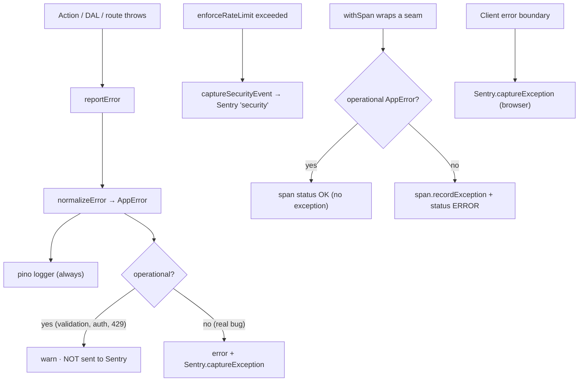

# Observability — logging & error tracking

One server-side choke-point (`reportError`) fans out to three sinks — structured
logs (pino), Sentry, and OpenTelemetry spans — each independently env-gated, so
call sites never change and everything runs fine with no Sentry/OTLP account
configured.

## Overview

Structured logs capture everything; Sentry captures the bugs and security
signals worth alerting on; OTLP spans trace the instrumented seams. The design
goal is **no triple-reporting**: a single operational error (validation,
auth, rate-limit) should appear once, at `warn`, and must not inflate Sentry
issues or trace error rates. Genuine bugs go everywhere.

## How it works

`reportError` (`apps/web/lib/observability.ts`) normalizes any throwable to an
`AppError`, then routes by whether it's operational. Spans are kept clean
separately in `withSpan` (`apps/web/lib/otel.ts`): operational `AppError`s are
recorded as `OK`, not as span exceptions / `ERROR` status, so the same error
isn't reported a third time on trace dashboards.



`next-safe-action` already routes action errors through `reportError`. The
client error boundaries (`apps/web/app/error.tsx`, `app/global-error.tsx`)
forward to Sentry explicitly with `Sentry.captureException` — Next does **not**
auto-capture errors that reach a boundary — and are no-ops unless
`NEXT_PUBLIC_SENTRY_DSN` is set.

`reportError`'s context `scope` is a typed `Scope` union (`action`,
`admin-action`, `outbox`, `jobs`, `stripe-webhook`, `csp`, …), so logs and
Sentry filter by a closed set of subsystem tags rather than ad-hoc strings.

## Logging (pino)

`@/lib/logger` is a structured, secret-redacting, server-only pino logger
(`LOG_LEVEL` controls verbosity). Output is line-delimited JSON — pipe it to any
aggregator. In dev: `pnpm dev | pino-pretty`. Never log secrets; the logger
redacts common fields (`password`, `token`, `cookie`, …) defensively.

## Error tracking (Sentry)

Disabled by default — with no `SENTRY_DSN`, the SDK is inert and no build plugin
runs (`next.config.ts` applies `withSentryConfig` only when `SENTRY_DSN` is set).

- `instrumentation.ts` loads `sentry.server.config.ts` / `sentry.edge.config.ts`;
  `onRequestError` captures Server Component / route / action errors.
- `instrumentation-client.ts` initializes the browser SDK + navigation spans;
  client `tracesSampleRate` is `1` in dev and `0.1` in prod.
- A `/monitoring` tunnel route dodges ad-blockers.
- `sendDefaultPii: false` everywhere — opt into PII deliberately.

Security signals (rate-limit hits) are captured as Sentry messages tagged
`security` via `captureSecurityEvent` (`@/lib/sentry`).

### CSP violations

A real `/api/csp-report` route (`apps/web/app/api/csp-report/route.ts`) collects
Content-Security-Policy violations: point `CSP_REPORT_URI=/api/csp-report` and
run `CSP_REPORT_ONLY=true` to vet a policy. Each report is logged structured
(`scope: 'csp'`); the route returns 204 and never throws on a malformed body.
See [`docs/security.md`](./security.md).

## Distributed tracing (OpenTelemetry)

Optional OTLP tracing, off by default. Set `OTEL_EXPORTER_OTLP_ENDPOINT` (your
collector's base URL — `/v1/traces` is appended) to turn it on; absent, every
span hits the no-op tracer and nothing is exported. `OTEL_EXPORTER_OTLP_HEADERS`
(`key=value,key2=value2`) carries auth, `OTEL_SERVICE_NAME` sets `service.name`.

Spans are emitted at three seams, all manual (so they work under any provider):

- **Server Actions** — a middleware on the action clients wraps each action in an
  `action <name>` span (`lib/otel.ts`).
- **DAL** — every `withTransaction` is a `db.transaction` span (`@workspace/db`).
- **Outbox relay** — `outbox.batch` + per-event `outbox.dispatch` spans
  (`server/events/dispatch.ts`); the jobs worker emits `job.run`.

The provider lives in `server/observability/otel-bootstrap.ts` — registered by
`instrumentation.ts` for the web server, and by the standalone workers
(`worker:outbox`, `worker:jobs`) themselves.

**Sentry coexistence.** Sentry is built on OpenTelemetry and registers its own
(single) tracer provider, so when `SENTRY_DSN` is set Sentry owns tracing and the
OTLP exporter is not activated — unset `SENTRY_DSN` to export to your own
collector. The manual spans feed whichever provider is active.

## Key files

| Concern           | Path                                                                                                          |
| ----------------- | ------------------------------------------------------------------------------------------------------------- |
| Error choke-point | `@/lib/observability` ([`apps/web/lib/observability.ts`](../apps/web/lib/observability.ts))                   |
| Span helper       | `@/lib/otel` ([`apps/web/lib/otel.ts`](../apps/web/lib/otel.ts))                                              |
| Sentry seam       | `@/lib/sentry` ([`apps/web/lib/sentry.ts`](../apps/web/lib/sentry.ts))                                        |
| Logger            | `@/lib/logger` ([`apps/web/lib/logger.ts`](../apps/web/lib/logger.ts))                                        |
| OTEL bootstrap    | [`apps/web/server/observability/otel-bootstrap.ts`](../apps/web/server/observability/otel-bootstrap.ts)       |
| Client boundaries | [`apps/web/app/error.tsx`](../apps/web/app/error.tsx), [`global-error.tsx`](../apps/web/app/global-error.tsx) |
| CSP report route  | [`apps/web/app/api/csp-report/route.ts`](../apps/web/app/api/csp-report/route.ts)                             |

## Usage / example

Report from a non-action seam (a worker, a webhook handler) through the same
choke-point — pass a typed `scope` so it's filterable:

```ts
import { reportError } from '@/lib/observability'

try {
  await processStripeEvent(event)
} catch (error) {
  // Logged; forwarded to Sentry only if it's a non-operational bug.
  throw reportError(error, { scope: 'stripe-webhook', eventId: event.id })
}
```

## How to extend

1. Instrumenting a new subsystem? Add its tag to the `Scope` union in
   `apps/web/lib/observability.ts`, then pass `{ scope: '<new>' }` to
   `reportError` — keeping the set closed avoids inconsistent casing.
2. To trace a new seam, wrap it in `withSpan('<name>', fn)` from `@/lib/otel`;
   it records exceptions and sets status automatically (operational `AppError`s
   stay `OK`).
3. To fully remove Sentry: delete `sentry.*.config.ts` + `instrumentation*.ts`,
   the `withSentryConfig` wrap in `next.config.ts`, the boundary
   `captureException` calls, and the `@sentry/nextjs` dependency.

## Configuration

| Variable                                              | Required | Default              | Purpose                                            |
| ----------------------------------------------------- | -------- | -------------------- | -------------------------------------------------- |
| `LOG_LEVEL`                                           | No       | `info`               | pino verbosity                                     |
| `SENTRY_DSN`                                          | No       | —                    | Server/edge error capture; gates the build plugin  |
| `NEXT_PUBLIC_SENTRY_DSN`                              | No       | —                    | Browser error capture + client boundaries          |
| `SENTRY_ENVIRONMENT`                                  | No       | `NODE_ENV`           | Tags events by environment                         |
| `SENTRY_TRACES_SAMPLE_RATE`                           | No       | dev `1` / prod `0.1` | Server trace sampling rate                         |
| `SENTRY_ORG` / `SENTRY_PROJECT` / `SENTRY_AUTH_TOKEN` | No       | —                    | Source-map upload + the admin monitoring dashboard |
| `OTEL_EXPORTER_OTLP_ENDPOINT`                         | No       | —                    | Enables OTLP export (no-op when unset)             |
| `OTEL_EXPORTER_OTLP_HEADERS`                          | No       | —                    | OTLP auth headers (`k=v,k2=v2`)                    |
| `OTEL_SERVICE_NAME`                                   | No       | template name        | Sets `service.name` on spans                       |

## Admin monitoring

Operators with `monitoring.read` see live Sentry data (recent issues, event
volume, links into Sentry) at `/admin/monitoring` — see
[`docs/admin.md`](./admin.md). It uses the read-only Sentry REST API
(`SENTRY_AUTH_TOKEN` + org/project) and degrades to a "configure Sentry" state
when those aren't set.

## Related docs

- [Security](./security.md)
- [Architecture](./architecture.md)
- [Admin console](./admin.md)
- [Jobs](./jobs.md)
- [Events](./events.md)
