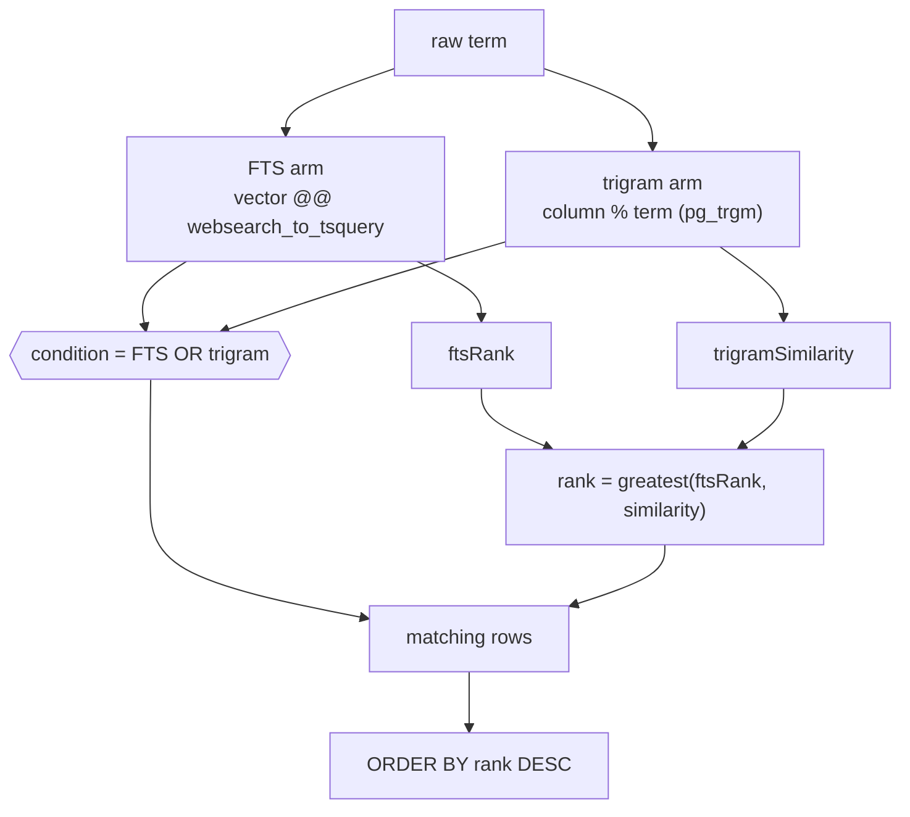

# Search

Postgres-native search with no extra infrastructure: **full-text**
(`websearch_to_tsquery` over a generated `tsvector`) combined with **typo-tolerant
`pg_trgm`** trigram matching, behind a typed seam that can later be swapped for an
external engine without changing the DAL shape.

## Overview

Full-text and trigram solve different problems, so search combines both arms:

- **`websearch_to_tsquery`** parses raw user input safely (quoted `"phrases"`,
  `OR`, `-negation`) and matches whole lexemes — great for multi-word and email
  queries. It never throws on malformed input.
- **`pg_trgm`** (`%` operator / `similarity()`) matches by 3-gram overlap —
  great for partial words and typos (`jon` → `John`), backed by a
  `gin_trgm_ops` index.

`smartTextSearch(...)` ORs the two arms and ranks by the **greater** of the
full-text rank and the trigram similarity. All terms are bound parameters
(injection-safe). The query primitives live in `@workspace/db`
(`packages/db/src/lib/search.ts`).

## How it works



## Key files

| Concern                | Path                                                |
| ---------------------- | --------------------------------------------------- |
| Query primitives       | `@workspace/db` (`packages/db/src/lib/search.ts`)   |
| User-search DAL        | `@/features/admin-users/queries.ts`                 |
| Users FTS + trgm index | `packages/db/migrations/000007_create_users.up.sql` |

## Usage

```ts
import {
  ftsMatch,
  ftsRank,
  trigramMatch,
  trigramSimilarity,
  smartTextSearch,
} from '@workspace/db'

ftsMatch(vector, term) // vector @@ websearch_to_tsquery('simple', term)
ftsRank(vector, term) // ts_rank(...) for ORDER BY
trigramMatch(column, term) // column % term   (uses the gin_trgm_ops index)
trigramSimilarity(column, term) // similarity(column, term) in [0,1]

const { condition, rank } = smartTextSearch({
  vector: sql`search_vector`, // a tsvector column / expression
  trigramColumn: users.name, // a gin_trgm_ops-indexed text column
  term,
})
// → condition: (FTS OR trigram); rank: greatest(ftsRank, similarity)
```

The default text-search config is `simple` (language-agnostic — right for names,
emails and identifiers); pass `'french'` / `'english'` for natural-language
stemming.

`app.users` carries a generated, stored FTS column:

```sql
search_vector tsvector GENERATED ALWAYS AS (
  to_tsvector('simple', name || ' ' || email::text)
) STORED;
-- CREATE INDEX users_search_idx ON app.users USING gin (search_vector);
-- CREATE INDEX users_name_trgm_idx ON app.users USING gin (name gin_trgm_ops);
```

The operator-console user list uses `smartTextSearch` for filtering + ranking,
and `suggestUsers(term)` provides trigram autocomplete — both in
`@/features/admin-users/queries.ts`.

## How to extend

1. Add a generated `search_vector tsvector … STORED` column over the searchable
   text **in that table's existing migration**, plus
   `CREATE INDEX … USING gin (search_vector)`. For autocomplete add a
   `gin (col gin_trgm_ops)` index on the column you want fuzzy-matched. See
   [database.md](./database.md) for migration conventions (schema-qualified,
   up/down SQL).
2. In the DAL, build the condition with
   `smartTextSearch({ vector: sql`search_vector`, trigramColumn, term })` and
   order by its `rank`.
3. **Upgrading to an external engine:** keep the DAL signatures
   (`listX({ search })`, `suggestX(term)`) and replace their bodies with calls to
   the external client (Meilisearch, Typesense, OpenSearch). Pages, actions, and
   types are unaffected — search is already behind the DAL.

## Related docs

- [Database](./database.md) — migrations, schema qualification, the DAL.
- [Admin / operators](./admin.md) — the operator user-search consumer.
- [ADR-0004](./adr/0004-concrete-vendors-behind-seams.md) — concrete vendors
  behind seams.
