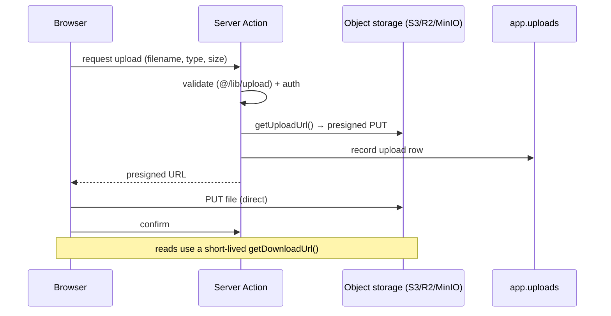

# Object storage (S3-compatible)

File uploads use S3-compatible object storage through `@/lib/storage` — the same
code path for **AWS S3**, **Cloudflare R2**, and **MinIO** (local or
self-hosted). Bytes never pass through the app server: the browser uploads
straight to storage with a presigned URL.

## Upload flow



Configured entirely by env (all required together; absent = uploads disabled):
`S3_REGION`, `S3_BUCKET`, `S3_ACCESS_KEY_ID`, `S3_SECRET_ACCESS_KEY`, and for
non-AWS providers `S3_ENDPOINT` + `S3_FORCE_PATH_STYLE=true`.

## Local development (MinIO)

`compose.dev.yaml` runs MinIO + a one-shot bucket creator, so uploads work out
of the box:

```bash
docker compose -f compose.dev.yaml up -d minio createbuckets
```

Then set in `.env` (console at <http://localhost:9001>, API at `:9000`):

```bash
S3_REGION=us-east-1
S3_BUCKET=app-uploads
S3_ACCESS_KEY_ID=minioadmin
S3_SECRET_ACCESS_KEY=minioadmin
S3_ENDPOINT=http://localhost:9000
S3_FORCE_PATH_STYLE=true
```

## Production

- **AWS S3 / Cloudflare R2:** point the `S3_*` vars at the provider (omit
  `S3_ENDPOINT` for AWS; set it for R2). Use a scoped IAM key, a private bucket,
  and rely on the presigned URLs for access.
- **Self-hosted MinIO on a VPS:** enable the opt-in storage profile —
  `docker compose -f compose.prod.yaml --profile storage up -d` — and set
  `S3_ENDPOINT=http://minio:9000`, `S3_FORCE_PATH_STYLE=true`, the bucket and the
  credentials (which become the MinIO root user/password) in `.env`. The MinIO
  ports are not published to the host; reach it over the internal network only.

## Security notes

- Buckets are created **private** (`mc anonymous set none`); never make them
  public — serve objects via presigned `getDownloadUrl()` instead.
- Presigned URLs are short-lived (15 min default); tune `expiresIn` per use.
- Validate content type and size before issuing an upload URL (`@/lib/upload`).
- Track every object in `app.uploads` so orphans can be reconciled/cleaned up.
