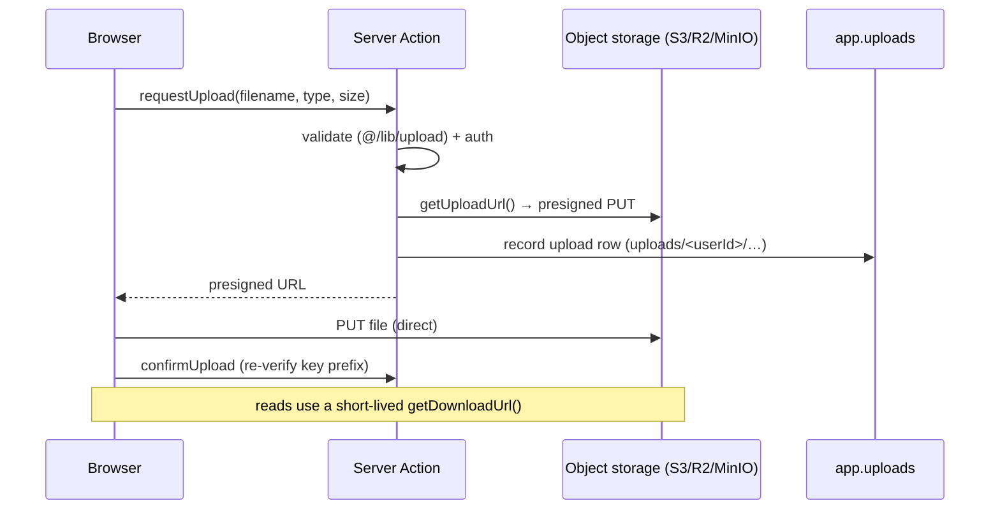

# Object storage (S3-compatible)

File uploads use S3-compatible object storage through `@/lib/storage` — one code
path for AWS S3, Cloudflare R2, and MinIO — and **degrade to disabled** when the
`S3_*` env is absent.

## Overview

Bytes never pass through the app server: the browser uploads straight to storage
with a presigned `PUT` URL, and reads use a short-lived presigned `GET`. Every
object is tracked in `app.uploads` so orphans can be reconciled. A ready-made
uploader lives at `/dashboard/files`.

## How it works



The flow is three actions in `@/app/dashboard/files/actions.ts`:

1. `requestUpload` — validates type/size and mints a presigned PUT URL under a
   user-namespaced key (`uploads/<userId>/…`).
2. the browser `PUT`s the file straight to storage, then
3. `confirmUpload` — re-verifies the key prefix and records the row in
   `app.uploads`.

The max upload size is driven by the **`uploads.maxMegabytes` feature flag**, so
it can be tuned without a deploy. Delete removes the object first, then
soft-deletes the row, so a storage failure never leaves a dangling reference.

## Key files

| Concern                | Path                               |
| ---------------------- | ---------------------------------- |
| Storage client         | `@/lib/storage`                    |
| Validation helpers     | `@/lib/upload`                     |
| Upload actions         | `@/app/dashboard/files/actions.ts` |
| File-management UI     | `@/app/dashboard/files/`           |
| Uploads tracking table | `app.uploads` (+ its DAL)          |

## Usage

```ts
import { getUploadUrl, getDownloadUrl } from '@/lib/storage'

// Server Action: mint a presigned PUT for a validated, user-namespaced key.
const url = await getUploadUrl({
  key: `uploads/${userId}/${filename}`,
  contentType,
  expiresIn: 900, // 15 min default
})

// Later, a short-lived read URL:
const href = await getDownloadUrl({ key })
```

## How to extend

1. **Add a provider** by pointing the `S3_*` vars at it — no code change for
   AWS / R2 / MinIO.
2. **Server-side image variants:** generate thumbnails in a background job
   (`@/lib/jobs`) after `confirmUpload`, or put an image-resizing CDN
   (Cloudflare Images, imgproxy) in front of the bucket — the `objectKey` is the
   stable handle either way.
3. **Configure CORS** so the browser may `PUT` from your origin: for local MinIO
   add a rule for `http://localhost:3000`; for S3/R2 set the bucket CORS policy.

## Configuration

All `S3_*` vars are required together; absent ⇒ uploads disabled.

| Variable               | Required          | Purpose                                        |
| ---------------------- | ----------------- | ---------------------------------------------- |
| `S3_REGION`            | yes               | Bucket region (e.g. `us-east-1`).              |
| `S3_BUCKET`            | yes               | Bucket name.                                   |
| `S3_ACCESS_KEY_ID`     | yes               | Access key.                                    |
| `S3_SECRET_ACCESS_KEY` | yes               | Secret key.                                    |
| `S3_ENDPOINT`          | non-AWS providers | Endpoint URL (set for R2/MinIO, omit for AWS). |
| `S3_FORCE_PATH_STYLE`  | non-AWS providers | `true` for MinIO / path-style addressing.      |

### Local development (MinIO)

`compose.dev.yaml` runs MinIO + a one-shot bucket creator, so uploads work out
of the box:

```bash
docker compose -f compose.dev.yaml up -d minio createbuckets
```

Then set in `.env` (console at <http://localhost:9001>, API at `:9000`):

```bash
S3_REGION=us-east-1
S3_BUCKET=app-uploads
S3_ACCESS_KEY_ID=minioadmin
S3_SECRET_ACCESS_KEY=minioadmin
S3_ENDPOINT=http://localhost:9000
S3_FORCE_PATH_STYLE=true
```

### Production

- **AWS S3 / Cloudflare R2:** point the `S3_*` vars at the provider (omit
  `S3_ENDPOINT` for AWS; set it for R2). Use a scoped IAM key, a private bucket,
  and rely on the presigned URLs for access.
- **Self-hosted MinIO on a VPS:** enable the opt-in storage profile —
  `docker compose -f compose.prod.yaml --profile storage up -d` — and set
  `S3_ENDPOINT=http://minio:9000`, `S3_FORCE_PATH_STYLE=true`, the bucket, and the
  credentials (which become the MinIO root user/password) in `.env`. The MinIO
  ports are not published to the host; reach it over the internal network only.

## Security notes

- Buckets are created **private** (`mc anonymous set none`); never make them
  public — serve objects via presigned `getDownloadUrl()` instead.
- Presigned URLs are short-lived (15 min default); tune `expiresIn` per use.
- Validate content type and size before issuing an upload URL (`@/lib/upload`).
- Object keys are namespaced by user id and re-verified on confirm, so a user
  can only register objects they own.
- Track every object in `app.uploads` so orphans can be reconciled/cleaned up.

## Related docs

- [Jobs](./jobs.md) — background image-variant generation.
- [Feature flags](./feature-flags.md) — the `uploads.maxMegabytes` flag.
- [Infrastructure](./infrastructure.md) — the MinIO compose profiles.
- [ADR-0004](./adr/0004-concrete-vendors-behind-seams.md) — concrete vendors
  behind seams.
