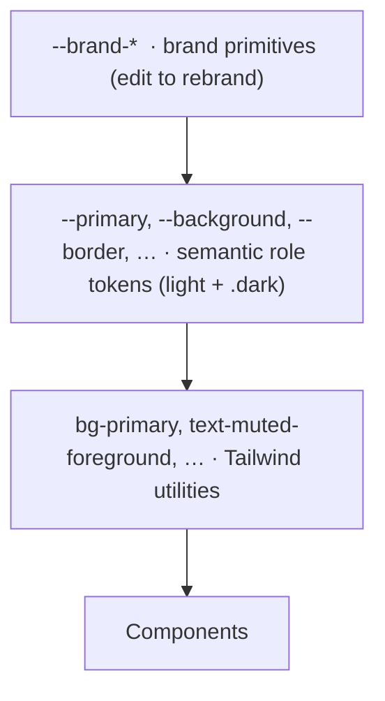

# Theming & rebranding

The UI is driven by a small set of CSS custom properties in
[`packages/ui/src/styles/globals.css`](../packages/ui/src/styles/globals.css), so
rebranding a project is usually a one-block edit.

## Overview

Color flows through three tiers: brand primitives map to semantic role tokens,
which `@theme inline` exposes as Tailwind utilities. Components only ever use the
semantic utilities, so editing the brand primitives re-skins the whole UI.

## How it works



Components only ever use the **semantic** utilities (`bg-primary`,
`text-muted-foreground`, `border-border`, …). They never hardcode a color, so a
change to the brand primitives flows everywhere — buttons, links, focus rings,
the sidebar, the auth panel, etc.

## Key files

| Concern                              | Path                                                        |
| ------------------------------------ | ----------------------------------------------------------- |
| Tokens (brand + semantic + `.admin`) | `packages/ui/src/styles/globals.css`                        |
| Theme presets (init)                 | `scripts/init-project.ts`                                   |
| PWA / browser-chrome color           | `apps/web/lib/site-config.ts` (`themeColor`)                |
| Email brand color                    | `packages/email/src/tokens.ts` (`emailTokens.colors.brand`) |
| Dark-mode provider                   | `apps/web/components/providers.tsx`                         |
| Mode toggle                          | `packages/ui/src/components/mode-toggle.tsx`                |

## Colors are oklch

Every token is `oklch(L C H)`:

- **L** — lightness, `0` (black) … `1` (white)
- **C** — chroma (saturation), `0` (gray) … ~`0.37`
- **H** — hue, `0`…`360` (e.g. indigo ≈ 277, emerald ≈ 163, blue ≈ 250)

oklch is perceptually uniform, so keeping L/C fixed and changing only H gives a
palette of consistent contrast. Pick a color with any oklch picker (e.g.
oklch.com).

## Usage / commands — rebrand in one block

Edit `--brand`, `--brand-foreground` and `--brand-ring` in **both** `:root`
(light) and `.dark` (dark). The default is indigo:

```css
:root {
  --brand: oklch(0.55 0.22 277); /* indigo — change the hue (277) to rebrand */
  --brand-foreground: oklch(0.985 0 0); /* text on the brand color */
  --brand-ring: oklch(0.55 0.22 277); /* focus ring */
}
.dark {
  --brand: oklch(0.62 0.19 277); /* a touch lighter for dark surfaces */
  --brand-foreground: oklch(0.985 0 0);
  --brand-ring: oklch(0.62 0.19 277);
}
```

To switch the whole UI to, say, emerald: change `277` to `163` in those six
lines. That's it.

Then keep two non-CSS values in sync (they can't read CSS variables):

1. `siteConfig.themeColor` in
   [`apps/web/lib/site-config.ts`](../apps/web/lib/site-config.ts) — the hex of
   `--brand`, used by the PWA manifest and browser chrome.
2. `emailTokens.colors.brand` in
   [`packages/email/src/tokens.ts`](../packages/email/src/tokens.ts) — the hex
   used by email templates (email clients don't support CSS vars).

## Theme presets (`project:init --theme`)

`pnpm project:init` can set the brand color for you. It ships five presets and
rewrites all three places at once — the `--brand-*` block (light + dark), the
`siteConfig.themeColor` hex, and the `emailTokens` brand hex — so they never
drift:

| Preset    | Hue | `themeColor`        |
| --------- | --- | ------------------- |
| `indigo`  | 277 | `#4f46e5` (default) |
| `blue`    | 264 | `#2563eb`           |
| `emerald` | 163 | `#059669`           |
| `violet`  | 293 | `#7c3aed`           |
| `rose`    | 16  | `#e11d48`           |

```bash
pnpm project:init --theme emerald      # non-interactive
pnpm project:init                      # or pick from the prompt
```

`indigo` is the default, so selecting it changes nothing. The admin console keeps
its own distinct hue (teal) regardless — see the `.admin` block in `globals.css`.
For a hue not listed here, pick `indigo` and edit the block by hand as above.

## How to extend

- **Tint the neutrals** — `--secondary`, `--muted`, `--accent`, `--border` are
  intentionally neutral grays. Give them a small chroma at the brand hue, e.g.
  `--accent: oklch(0.96 0.02 277)`.
- **A true second brand color** — add a `--brand-secondary` primitive and map
  `--secondary`/`--accent` to it.
- **Branded charts** — `--chart-1…5` are a neutral data-viz ramp; replace them
  with a branded ramp if you build dashboards.
- **Corner radius** — the whole UI scales from a single `--radius` token
  (`--radius-sm/md/lg/…` are computed from it).
- **Add components** — shadcn (Base UI) components live in
  `packages/ui/src/components`; add more with `pnpm ui:add <component>`.

## Dark mode

Implemented with `next-themes` (`attribute="class"`, `defaultTheme="system"`).
The `.dark` class on `<html>` swaps the semantic tokens. Toggle with the
`ModeToggle` component
([`packages/ui/src/components/mode-toggle.tsx`](../packages/ui/src/components/mode-toggle.tsx)).
The provider is wired in
[`apps/web/components/providers.tsx`](../apps/web/components/providers.tsx) and
carries the CSP nonce from `proxy.ts`.

## Related docs

- [Operator console](./admin.md)
- [Infrastructure](./infrastructure.md)
